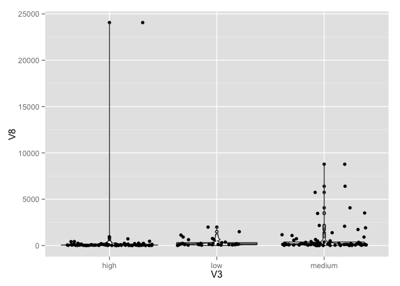
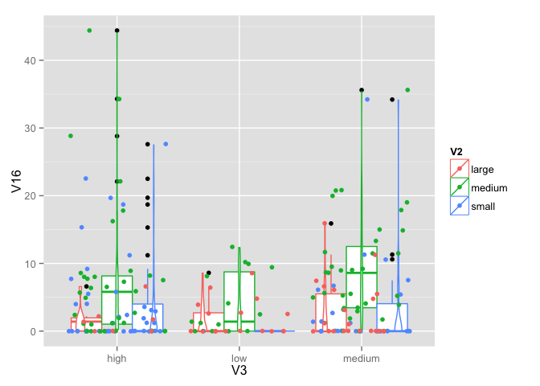
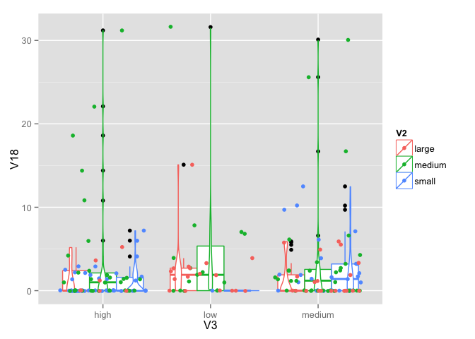
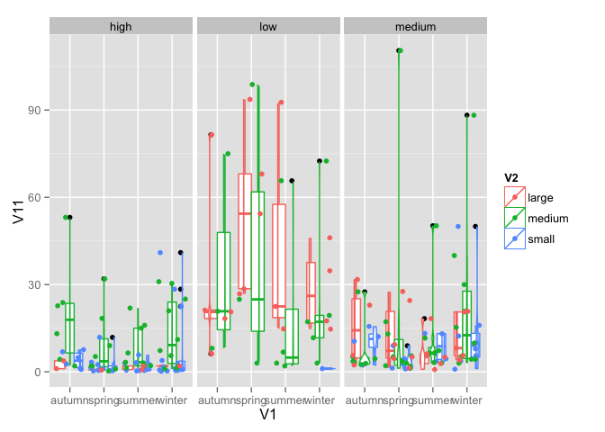

    source('../utils.r')
    source('0_lectura.r')
    library(plyr)
    library(dplyr)

    ## 
    ## Attaching package: 'dplyr'
    ## 
    ## The following objects are masked from 'package:plyr':
    ## 
    ##     arrange, count, desc, failwith, id, mutate, rename, summarise,
    ##     summarize
    ## 
    ## The following object is masked from 'package:stats':
    ## 
    ##     filter
    ## 
    ## The following objects are masked from 'package:base':
    ## 
    ##     intersect, setdiff, setequal, union

    library(ggplot2)
    library(corrgram)

    ## 
    ## Attaching package: 'corrgram'
    ## 
    ## The following object is masked from 'package:plyr':
    ## 
    ##     baseball

    ## [1] "V4"

    ## Warning: Removed 1 rows containing non-finite values (stat_boxplot).

    ## Warning: Removed 1 rows containing non-finite values (stat_ydensity).

    ## Warning: Removed 1 rows containing missing values (geom_point).

    ## [1] "V5"

    ## Warning: Removed 2 rows containing non-finite values (stat_boxplot).

    ## Warning: Removed 2 rows containing non-finite values (stat_ydensity).

    ## Warning: Removed 2 rows containing missing values (geom_point).

    ## [1] "V6"

    ## Warning: Removed 10 rows containing non-finite values (stat_boxplot).

    ## Warning: Removed 10 rows containing non-finite values (stat_ydensity).

    ## Warning: Removed 10 rows containing missing values (geom_point).

    ## [1] "V7"

    ## Warning: Removed 2 rows containing non-finite values (stat_boxplot).

    ## Warning: Removed 2 rows containing non-finite values (stat_ydensity).

    ## Warning: Removed 2 rows containing missing values (geom_point).

    ## [1] "V8"

    ## Warning: Removed 2 rows containing non-finite values (stat_boxplot).

    ## Warning: Removed 2 rows containing non-finite values (stat_ydensity).

    ## Warning: Removed 2 rows containing missing values (geom_point).

    ## [1] "V9"

    ## Warning: Removed 2 rows containing non-finite values (stat_boxplot).

    ## Warning: Removed 2 rows containing non-finite values (stat_ydensity).

    ## Warning: Removed 2 rows containing missing values (geom_point).

    ## [1] "V10"

    ## Warning: Removed 2 rows containing non-finite values (stat_boxplot).

    ## Warning: Removed 2 rows containing non-finite values (stat_ydensity).

    ## Warning: Removed 2 rows containing missing values (geom_point).

    ## [1] "V11"

    ## Warning: Removed 12 rows containing non-finite values (stat_boxplot).

    ## Warning: Removed 12 rows containing non-finite values (stat_ydensity).

    ## Warning: Removed 12 rows containing missing values (geom_point).

    ## [1] "V12"

    ## [1] "V13"

    ## [1] "V14"

    ## [1] "V15"

    ## [1] "V16"

    ## [1] "V17"

    ## [1] "V18"

    ## [1] "V4"

    ## Warning: Removed 1 rows containing non-finite values (stat_boxplot).

    ## Warning: Removed 1 rows containing non-finite values (stat_ydensity).

    ## Warning: Removed 1 rows containing missing values (geom_point).

    ## [1] "V5"

    ## Warning: Removed 2 rows containing non-finite values (stat_boxplot).

    ## Warning: Removed 2 rows containing non-finite values (stat_ydensity).

    ## Warning: Removed 2 rows containing missing values (geom_point).

    ## [1] "V6"

    ## Warning: Removed 10 rows containing non-finite values (stat_boxplot).

    ## Warning: Removed 10 rows containing non-finite values (stat_ydensity).

    ## Warning: Removed 10 rows containing missing values (geom_point).

    ## [1] "V7"

    ## Warning: Removed 2 rows containing non-finite values (stat_boxplot).

    ## Warning: Removed 2 rows containing non-finite values (stat_ydensity).

    ## Warning: Removed 2 rows containing missing values (geom_point).

    ## [1] "V8"

    ## Warning: Removed 2 rows containing non-finite values (stat_boxplot).

    ## Warning: Removed 2 rows containing non-finite values (stat_ydensity).

    ## Warning: Removed 2 rows containing missing values (geom_point).

    ## [1] "V9"

    ## Warning: Removed 2 rows containing non-finite values (stat_boxplot).

    ## Warning: Removed 2 rows containing non-finite values (stat_ydensity).

    ## Warning: Removed 2 rows containing missing values (geom_point).

    ## [1] "V10"

    ## Warning: Removed 2 rows containing non-finite values (stat_boxplot).

    ## Warning: Removed 2 rows containing non-finite values (stat_ydensity).

    ## Warning: Removed 2 rows containing missing values (geom_point).

    ## [1] "V11"

    ## Warning: Removed 12 rows containing non-finite values (stat_boxplot).

    ## Warning: Removed 12 rows containing non-finite values (stat_ydensity).

    ## Warning: Removed 12 rows containing missing values (geom_point).

    ## [1] "V12"

    ## [1] "V13"

    ## [1] "V14"

    ## [1] "V15"

    ## [1] "V16"

    ## [1] "V17"

    ## [1] "V18"

    ## [1] "V4"

    ## Warning: Removed 1 rows containing non-finite values (stat_boxplot).

    ## Warning: Removed 1 rows containing non-finite values (stat_ydensity).

    ## Warning: Removed 1 rows containing missing values (geom_point).

    ## [1] "V5"

    ## Warning: Removed 2 rows containing non-finite values (stat_boxplot).

    ## Warning: Removed 2 rows containing non-finite values (stat_ydensity).

    ## Warning: Removed 2 rows containing missing values (geom_point).

    ## [1] "V6"

    ## Warning: Removed 10 rows containing non-finite values (stat_boxplot).

    ## Warning: Removed 10 rows containing non-finite values (stat_ydensity).

    ## Warning: Removed 10 rows containing missing values (geom_point).

    ## [1] "V7"

    ## Warning: Removed 2 rows containing non-finite values (stat_boxplot).

    ## Warning: Removed 2 rows containing non-finite values (stat_ydensity).

    ## Warning: Removed 2 rows containing missing values (geom_point).

    ## [1] "V8"

    ## Warning: Removed 2 rows containing non-finite values (stat_boxplot).

    ## Warning: Removed 2 rows containing non-finite values (stat_ydensity).

    ## Warning: Removed 2 rows containing missing values (geom_point).

    ## [1] "V9"

    ## Warning: Removed 2 rows containing non-finite values (stat_boxplot).

    ## Warning: Removed 2 rows containing non-finite values (stat_ydensity).

    ## Warning: Removed 2 rows containing missing values (geom_point).

    ## [1] "V10"

    ## Warning: Removed 2 rows containing non-finite values (stat_boxplot).

    ## Warning: Removed 2 rows containing non-finite values (stat_ydensity).

    ## Warning: Removed 2 rows containing missing values (geom_point).

    ## [1] "V11"

    ## Warning: Removed 12 rows containing non-finite values (stat_boxplot).

    ## Warning: Removed 12 rows containing non-finite values (stat_ydensity).

    ## Warning: Removed 12 rows containing missing values (geom_point).

    ## [1] "V12"

    ## [1] "V13"

    ## [1] "V14"

    ## [1] "V15"

    ## [1] "V16"

    ## [1] "V17"

    ## [1] "V18"

    ## [1] "V4"

    ## Warning: Removed 1 rows containing non-finite values (stat_boxplot).

    ## Warning: Removed 1 rows containing non-finite values (stat_ydensity).

    ## Warning: Removed 1 rows containing missing values (geom_point).

    ## [1] "V5"

    ## Warning: Removed 2 rows containing non-finite values (stat_boxplot).

    ## Warning: Removed 2 rows containing non-finite values (stat_ydensity).

    ## Warning: Removed 2 rows containing missing values (geom_point).

    ## [1] "V6"

    ## Warning: Removed 10 rows containing non-finite values (stat_boxplot).

    ## Warning: Removed 10 rows containing non-finite values (stat_ydensity).

    ## Warning: Removed 10 rows containing missing values (geom_point).

    ## [1] "V7"

    ## Warning: Removed 2 rows containing non-finite values (stat_boxplot).

    ## Warning: Removed 2 rows containing non-finite values (stat_ydensity).

    ## Warning: Removed 2 rows containing missing values (geom_point).

    ## [1] "V8"

    ## Warning: Removed 2 rows containing non-finite values (stat_boxplot).

    ## Warning: Removed 2 rows containing non-finite values (stat_ydensity).

    ## Warning: Removed 2 rows containing missing values (geom_point).

    ## [1] "V9"

    ## Warning: Removed 2 rows containing non-finite values (stat_boxplot).

    ## Warning: Removed 2 rows containing non-finite values (stat_ydensity).

    ## Warning: Removed 2 rows containing missing values (geom_point).

    ## [1] "V10"

    ## Warning: Removed 2 rows containing non-finite values (stat_boxplot).

    ## Warning: Removed 2 rows containing non-finite values (stat_ydensity).

    ## Warning: Removed 2 rows containing missing values (geom_point).

    ## [1] "V11"

    ## Warning: Removed 12 rows containing non-finite values (stat_boxplot).

    ## Warning: Removed 12 rows containing non-finite values (stat_ydensity).

    ## Warning: Removed 12 rows containing missing values (geom_point).

    ## [1] "V12"

    ## [1] "V13"

    ## [1] "V14"

    ## [1] "V15"

    ## [1] "V16"

    ## [1] "V17"

    ## [1] "V18"

    ## [1] "V4"

    ## Warning: Removed 1 rows containing non-finite values (stat_boxplot).

    ## Warning: Removed 1 rows containing non-finite values (stat_ydensity).

    ## Warning: Removed 1 rows containing missing values (geom_point).

    ## [1] "V5"

    ## Warning: Removed 2 rows containing non-finite values (stat_boxplot).

    ## Warning: Removed 2 rows containing non-finite values (stat_ydensity).

    ## Warning: Removed 2 rows containing missing values (geom_point).

    ## [1] "V6"

    ## Warning: Removed 10 rows containing non-finite values (stat_boxplot).

    ## Warning: Removed 10 rows containing non-finite values (stat_ydensity).

    ## Warning: Removed 10 rows containing missing values (geom_point).

    ## [1] "V7"

    ## Warning: Removed 2 rows containing non-finite values (stat_boxplot).

    ## Warning: Removed 2 rows containing non-finite values (stat_ydensity).

    ## Warning: Removed 2 rows containing missing values (geom_point).

    ## [1] "V8"

    ## Warning: Removed 2 rows containing non-finite values (stat_boxplot).

    ## Warning: Removed 2 rows containing non-finite values (stat_ydensity).

    ## Warning: Removed 2 rows containing missing values (geom_point).

    ## [1] "V9"

    ## Warning: Removed 2 rows containing non-finite values (stat_boxplot).

    ## Warning: Removed 2 rows containing non-finite values (stat_ydensity).

    ## Warning: Removed 2 rows containing missing values (geom_point).

    ## [1] "V10"

    ## Warning: Removed 2 rows containing non-finite values (stat_boxplot).

    ## Warning: Removed 2 rows containing non-finite values (stat_ydensity).

    ## Warning: Removed 2 rows containing missing values (geom_point).

    ## [1] "V11"

    ## Warning: Removed 12 rows containing non-finite values (stat_boxplot).

    ## Warning: Removed 12 rows containing non-finite values (stat_ydensity).

    ## Warning: Removed 12 rows containing missing values (geom_point).

    ## [1] "V12"

    ## [1] "V13"

    ## [1] "V14"

    ## [1] "V15"

    ## [1] "V16"

    ## [1] "V17"

    ## [1] "V18"

    ## [1] "V4"

    ## Warning: Removed 1 rows containing non-finite values (stat_boxplot).

    ## Warning: Removed 1 rows containing non-finite values (stat_ydensity).

    ## Warning: Removed 1 rows containing missing values (geom_point).

    ## [1] "V5"

    ## Warning: Removed 2 rows containing non-finite values (stat_boxplot).

    ## Warning: Removed 2 rows containing non-finite values (stat_ydensity).

    ## Warning: Removed 2 rows containing missing values (geom_point).

    ## [1] "V6"

    ## Warning: Removed 10 rows containing non-finite values (stat_boxplot).

    ## Warning: Removed 10 rows containing non-finite values (stat_ydensity).

    ## Warning: Removed 10 rows containing missing values (geom_point).

    ## [1] "V7"

    ## Warning: Removed 2 rows containing non-finite values (stat_boxplot).

    ## Warning: Removed 2 rows containing non-finite values (stat_ydensity).

    ## Warning: Removed 2 rows containing missing values (geom_point).

    ## [1] "V8"

    ## Warning: Removed 2 rows containing non-finite values (stat_boxplot).

    ## Warning: Removed 2 rows containing non-finite values (stat_ydensity).

    ## Warning: Removed 2 rows containing missing values (geom_point).

    ## [1] "V9"

    ## Warning: Removed 2 rows containing non-finite values (stat_boxplot).

    ## Warning: Removed 2 rows containing non-finite values (stat_ydensity).

    ## Warning: Removed 2 rows containing missing values (geom_point).

    ## [1] "V10"

    ## Warning: Removed 2 rows containing non-finite values (stat_boxplot).

    ## Warning: Removed 2 rows containing non-finite values (stat_ydensity).

    ## Warning: Removed 2 rows containing missing values (geom_point).

    ## [1] "V11"

    ## Warning: Removed 12 rows containing non-finite values (stat_boxplot).

    ## Warning: Removed 12 rows containing non-finite values (stat_ydensity).

    ## Warning: Removed 12 rows containing missing values (geom_point).

    ## [1] "V12"

    ## [1] "V13"

    ## [1] "V14"

    ## [1] "V15"

    ## [1] "V16"

    ## [1] "V17"

    ## [1] "V18"

    ## [1] "V4"

    ## Warning: Removed 1 rows containing non-finite values (stat_boxplot).

    ## Warning: Removed 1 rows containing non-finite values (stat_ydensity).

    ## Warning: Removed 1 rows containing missing values (geom_point).

    ## [1] "V5"

    ## Warning: Removed 2 rows containing non-finite values (stat_boxplot).

    ## Warning: Removed 2 rows containing non-finite values (stat_ydensity).

    ## Warning: Removed 2 rows containing missing values (geom_point).

    ## [1] "V6"

    ## Warning: Removed 10 rows containing non-finite values (stat_boxplot).

    ## Warning: Removed 10 rows containing non-finite values (stat_ydensity).

    ## Warning: Removed 10 rows containing missing values (geom_point).

    ## [1] "V7"

    ## Warning: Removed 2 rows containing non-finite values (stat_boxplot).

    ## Warning: Removed 2 rows containing non-finite values (stat_ydensity).

    ## Warning: Removed 2 rows containing missing values (geom_point).

    ## [1] "V8"

    ## Warning: Removed 2 rows containing non-finite values (stat_boxplot).

    ## Warning: Removed 2 rows containing non-finite values (stat_ydensity).

    ## Warning: Removed 2 rows containing missing values (geom_point).

    ## [1] "V9"

    ## Warning: Removed 2 rows containing non-finite values (stat_boxplot).

    ## Warning: Removed 2 rows containing non-finite values (stat_ydensity).

    ## Warning: Removed 2 rows containing missing values (geom_point).

    ## [1] "V10"

    ## Warning: Removed 2 rows containing non-finite values (stat_boxplot).

    ## Warning: Removed 2 rows containing non-finite values (stat_ydensity).

    ## Warning: Removed 2 rows containing missing values (geom_point).

    ## [1] "V11"

    ## Warning: Removed 12 rows containing non-finite values (stat_boxplot).

    ## Warning: Removed 12 rows containing non-finite values (stat_ydensity).

    ## Warning: Removed 12 rows containing missing values (geom_point).

    ## [1] "V12"

    ## [1] "V13"

    ## [1] "V14"

    ## [1] "V15"

    ## [1] "V16"

    ## [1] "V17"

    ## [1] "V18"

    ## [1] "V4"

    ## Warning: Removed 1 rows containing non-finite values (stat_boxplot).

    ## Warning: Removed 1 rows containing non-finite values (stat_ydensity).

    ## Warning: Removed 1 rows containing missing values (geom_point).

    ## [1] "V5"

    ## Warning: Removed 2 rows containing non-finite values (stat_boxplot).

    ## Warning: Removed 2 rows containing non-finite values (stat_ydensity).

    ## Warning: Removed 2 rows containing missing values (geom_point).

    ## [1] "V6"

    ## Warning: Removed 10 rows containing non-finite values (stat_boxplot).

    ## Warning: Removed 10 rows containing non-finite values (stat_ydensity).

    ## Warning: Removed 10 rows containing missing values (geom_point).

    ## [1] "V7"

    ## Warning: Removed 2 rows containing non-finite values (stat_boxplot).

    ## Warning: Removed 2 rows containing non-finite values (stat_ydensity).

    ## Warning: Removed 2 rows containing missing values (geom_point).

    ## [1] "V8"

    ## Warning: Removed 2 rows containing non-finite values (stat_boxplot).

    ## Warning: Removed 2 rows containing non-finite values (stat_ydensity).

    ## Warning: Removed 2 rows containing missing values (geom_point).

    ## [1] "V9"

    ## Warning: Removed 2 rows containing non-finite values (stat_boxplot).

    ## Warning: Removed 2 rows containing non-finite values (stat_ydensity).

    ## Warning: Removed 2 rows containing missing values (geom_point).

    ## [1] "V10"

    ## Warning: Removed 2 rows containing non-finite values (stat_boxplot).

    ## Warning: Removed 2 rows containing non-finite values (stat_ydensity).

    ## Warning: Removed 2 rows containing missing values (geom_point).

    ## [1] "V11"

    ## Warning: Removed 12 rows containing non-finite values (stat_boxplot).

    ## Warning: Removed 12 rows containing non-finite values (stat_ydensity).

    ## Warning: Removed 12 rows containing missing values (geom_point).

    ## [1] "V12"

    ## [1] "V13"

    ## [1] "V14"

    ## [1] "V15"

    ## [1] "V16"

    ## [1] "V17"

    ## [1] "V18"

    ## [1] "V4"

    ## Warning: Removed 1 rows containing non-finite values (stat_boxplot).

    ## Warning: Removed 1 rows containing non-finite values (stat_ydensity).

    ## Warning: Removed 1 rows containing missing values (geom_point).

    ## [1] "V5"

    ## Warning: Removed 2 rows containing non-finite values (stat_boxplot).

    ## Warning: Removed 2 rows containing non-finite values (stat_ydensity).

    ## Warning: Removed 2 rows containing missing values (geom_point).

    ## [1] "V6"

    ## Warning: Removed 10 rows containing non-finite values (stat_boxplot).

    ## Warning: Removed 10 rows containing non-finite values (stat_ydensity).

    ## Warning: Removed 10 rows containing missing values (geom_point).

    ## [1] "V7"

    ## Warning: Removed 2 rows containing non-finite values (stat_boxplot).

    ## Warning: Removed 2 rows containing non-finite values (stat_ydensity).

    ## Warning: Removed 2 rows containing missing values (geom_point).

    ## [1] "V8"

    ## Warning: Removed 2 rows containing non-finite values (stat_boxplot).

    ## Warning: Removed 2 rows containing non-finite values (stat_ydensity).

    ## Warning: Removed 2 rows containing missing values (geom_point).

    ## [1] "V9"

    ## Warning: Removed 2 rows containing non-finite values (stat_boxplot).

    ## Warning: Removed 2 rows containing non-finite values (stat_ydensity).

    ## Warning: Removed 2 rows containing missing values (geom_point).

    ## [1] "V10"

    ## Warning: Removed 2 rows containing non-finite values (stat_boxplot).

    ## Warning: Removed 2 rows containing non-finite values (stat_ydensity).

    ## Warning: Removed 2 rows containing missing values (geom_point).

    ## [1] "V11"

    ## Warning: Removed 12 rows containing non-finite values (stat_boxplot).

    ## Warning: Removed 12 rows containing non-finite values (stat_ydensity).

    ## Warning: Removed 12 rows containing missing values (geom_point).

    ## [1] "V12"

    ## [1] "V13"

    ## [1] "V14"

    ## [1] "V15"

    ## [1] "V16"

    ## [1] "V17"

    ## [1] "V18"

    ## [1] "V4"

    ## Warning: Removed 1 rows containing non-finite values (stat_boxplot).

    ## Warning: Removed 1 rows containing non-finite values (stat_ydensity).

    ## Warning: Removed 1 rows containing missing values (geom_point).

    ## [1] "V5"

    ## Warning: Removed 1 rows containing non-finite values (stat_boxplot).

    ## Warning: Removed 1 rows containing non-finite values (stat_boxplot).

    ## Warning: Removed 1 rows containing non-finite values (stat_ydensity).

    ## Warning: Removed 1 rows containing non-finite values (stat_ydensity).

    ## Warning: Removed 1 rows containing missing values (geom_point).

    ## Warning: Removed 1 rows containing missing values (geom_point).

    ## [1] "V6"

    ## Warning: Removed 2 rows containing non-finite values (stat_boxplot).

    ## Warning: Removed 4 rows containing non-finite values (stat_boxplot).

    ## Warning: Removed 2 rows containing non-finite values (stat_boxplot).

    ## Warning: Removed 2 rows containing non-finite values (stat_boxplot).

    ## Warning: Removed 2 rows containing non-finite values (stat_ydensity).

    ## Warning: Removed 4 rows containing non-finite values (stat_ydensity).

    ## Warning: Removed 2 rows containing non-finite values (stat_ydensity).

    ## Warning: Removed 2 rows containing non-finite values (stat_ydensity).

    ## Warning: Removed 2 rows containing missing values (geom_point).

    ## Warning: Removed 4 rows containing missing values (geom_point).

    ## Warning: Removed 2 rows containing missing values (geom_point).

    ## Warning: Removed 2 rows containing missing values (geom_point).

    ## [1] "V7"

    ## Warning: Removed 1 rows containing non-finite values (stat_boxplot).

    ## Warning: Removed 1 rows containing non-finite values (stat_boxplot).

    ## Warning: Removed 1 rows containing non-finite values (stat_ydensity).

    ## Warning: Removed 1 rows containing non-finite values (stat_ydensity).

    ## Warning: Removed 1 rows containing missing values (geom_point).

    ## Warning: Removed 1 rows containing missing values (geom_point).

    ## [1] "V8"

    ## Warning: Removed 1 rows containing non-finite values (stat_boxplot).

    ## Warning: Removed 1 rows containing non-finite values (stat_boxplot).

    ## Warning: Removed 1 rows containing non-finite values (stat_ydensity).

    ## Warning: Removed 1 rows containing non-finite values (stat_ydensity).

    ## Warning: Removed 1 rows containing missing values (geom_point).

    ## Warning: Removed 1 rows containing missing values (geom_point).

    ## [1] "V9"

    ## Warning: Removed 1 rows containing non-finite values (stat_boxplot).

    ## Warning: Removed 1 rows containing non-finite values (stat_boxplot).

    ## Warning: Removed 1 rows containing non-finite values (stat_ydensity).

    ## Warning: Removed 1 rows containing non-finite values (stat_ydensity).

    ## Warning: Removed 1 rows containing missing values (geom_point).

    ## Warning: Removed 1 rows containing missing values (geom_point).

    ## [1] "V10"

    ## Warning: Removed 1 rows containing non-finite values (stat_boxplot).

    ## Warning: Removed 1 rows containing non-finite values (stat_boxplot).

    ## Warning: Removed 1 rows containing non-finite values (stat_ydensity).

    ## Warning: Removed 1 rows containing non-finite values (stat_ydensity).

    ## Warning: Removed 1 rows containing missing values (geom_point).

    ## Warning: Removed 1 rows containing missing values (geom_point).

    ## [1] "V11"

    ## Warning: Removed 3 rows containing non-finite values (stat_boxplot).

    ## Warning: Removed 3 rows containing non-finite values (stat_boxplot).

    ## Warning: Removed 2 rows containing non-finite values (stat_boxplot).

    ## Warning: Removed 4 rows containing non-finite values (stat_boxplot).

    ## Warning: Removed 3 rows containing non-finite values (stat_ydensity).

    ## Warning: Removed 3 rows containing non-finite values (stat_ydensity).

    ## Warning: Removed 2 rows containing non-finite values (stat_ydensity).

    ## Warning: Removed 4 rows containing non-finite values (stat_ydensity).

    ## Warning: Removed 3 rows containing missing values (geom_point).

    ## Warning: Removed 3 rows containing missing values (geom_point).

    ## Warning: Removed 2 rows containing missing values (geom_point).

    ## Warning: Removed 4 rows containing missing values (geom_point).

    ## [1] "V12"

    ## [1] "V13"

    ## [1] "V14"

    ## [1] "V15"

    ## [1] "V16"

    ## [1] "V17"

    ## [1] "V18"

    ## [1] "V4"

    ## Warning: Removed 1 rows containing non-finite values (stat_boxplot).

    ## Warning: Removed 1 rows containing non-finite values (stat_ydensity).

    ## Warning: Removed 1 rows containing missing values (geom_point).

    ## [1] "V5"

    ## Warning: Removed 1 rows containing non-finite values (stat_boxplot).

    ## Warning: Removed 1 rows containing non-finite values (stat_boxplot).

    ## Warning: Removed 1 rows containing non-finite values (stat_ydensity).

    ## Warning: Removed 1 rows containing non-finite values (stat_ydensity).

    ## Warning: Removed 1 rows containing missing values (geom_point).

    ## Warning: Removed 1 rows containing missing values (geom_point).

    ## [1] "V6"

    ## Warning: Removed 3 rows containing non-finite values (stat_boxplot).

    ## Warning: Removed 1 rows containing non-finite values (stat_boxplot).

    ## Warning: Removed 6 rows containing non-finite values (stat_boxplot).

    ## Warning: Removed 3 rows containing non-finite values (stat_ydensity).

    ## Warning: Removed 1 rows containing non-finite values (stat_ydensity).

    ## Warning: Removed 6 rows containing non-finite values (stat_ydensity).

    ## Warning: Removed 3 rows containing missing values (geom_point).

    ## Warning: Removed 1 rows containing missing values (geom_point).

    ## Warning: Removed 6 rows containing missing values (geom_point).

    ## [1] "V7"

    ## Warning: Removed 2 rows containing non-finite values (stat_boxplot).

    ## Warning: Removed 2 rows containing non-finite values (stat_ydensity).

    ## Warning: Removed 2 rows containing missing values (geom_point).

    ## [1] "V8"

    ## Warning: Removed 2 rows containing non-finite values (stat_boxplot).

    ## Warning: Removed 2 rows containing non-finite values (stat_ydensity).

    ## Warning: Removed 2 rows containing missing values (geom_point).

    ## [1] "V9"

    ## Warning: Removed 2 rows containing non-finite values (stat_boxplot).

    ## Warning: Removed 2 rows containing non-finite values (stat_ydensity).

    ## Warning: Removed 2 rows containing missing values (geom_point).

    ## [1] "V10"

    ## Warning: Removed 1 rows containing non-finite values (stat_boxplot).

    ## Warning: Removed 1 rows containing non-finite values (stat_boxplot).

    ## Warning: Removed 1 rows containing non-finite values (stat_ydensity).

    ## Warning: Removed 1 rows containing non-finite values (stat_ydensity).

    ## Warning: Removed 1 rows containing missing values (geom_point).

    ## Warning: Removed 1 rows containing missing values (geom_point).

    ## [1] "V11"

    ## Warning: Removed 6 rows containing non-finite values (stat_boxplot).

    ## Warning: Removed 6 rows containing non-finite values (stat_boxplot).

    ## Warning: Removed 6 rows containing non-finite values (stat_ydensity).

    ## Warning: Removed 6 rows containing non-finite values (stat_ydensity).

    ## Warning: Removed 6 rows containing missing values (geom_point).

    ## Warning: Removed 6 rows containing missing values (geom_point).

    ## [1] "V12"

    ## [1] "V13"

    ## [1] "V14"

    ## [1] "V15"

    ## [1] "V16"

    ## [1] "V17"

    ## [1] "V18"

    ## [1] "V4"

    ## Warning: Removed 1 rows containing non-finite values (stat_boxplot).

    ## Warning: Removed 1 rows containing non-finite values (stat_ydensity).

    ## Warning: Removed 1 rows containing missing values (geom_point).

    ## [1] "V5"

    ## Warning: Removed 2 rows containing non-finite values (stat_boxplot).

    ## Warning: Removed 2 rows containing non-finite values (stat_ydensity).

    ## Warning: Removed 2 rows containing missing values (geom_point).

    ## [1] "V6"

    ## Warning: Removed 2 rows containing non-finite values (stat_boxplot).

    ## Warning: Removed 8 rows containing non-finite values (stat_boxplot).

    ## Warning: Removed 2 rows containing non-finite values (stat_ydensity).

    ## Warning: Removed 8 rows containing non-finite values (stat_ydensity).

    ## Warning: Removed 2 rows containing missing values (geom_point).

    ## Warning: Removed 8 rows containing missing values (geom_point).

    ## [1] "V7"

    ## Warning: Removed 1 rows containing non-finite values (stat_boxplot).

    ## Warning: Removed 1 rows containing non-finite values (stat_boxplot).

    ## Warning: Removed 1 rows containing non-finite values (stat_ydensity).

    ## Warning: Removed 1 rows containing non-finite values (stat_ydensity).

    ## Warning: Removed 1 rows containing missing values (geom_point).

    ## Warning: Removed 1 rows containing missing values (geom_point).

    ## [1] "V8"

    ## Warning: Removed 1 rows containing non-finite values (stat_boxplot).

    ## Warning: Removed 1 rows containing non-finite values (stat_boxplot).

    ## Warning: Removed 1 rows containing non-finite values (stat_ydensity).

    ## Warning: Removed 1 rows containing non-finite values (stat_ydensity).

    ## Warning: Removed 1 rows containing missing values (geom_point).

    ## Warning: Removed 1 rows containing missing values (geom_point).

    ## [1] "V9"

    ## Warning: Removed 1 rows containing non-finite values (stat_boxplot).

    ## Warning: Removed 1 rows containing non-finite values (stat_boxplot).

    ## Warning: Removed 1 rows containing non-finite values (stat_ydensity).

    ## Warning: Removed 1 rows containing non-finite values (stat_ydensity).

    ## Warning: Removed 1 rows containing missing values (geom_point).

    ## Warning: Removed 1 rows containing missing values (geom_point).

    ## [1] "V10"

    ## Warning: Removed 1 rows containing non-finite values (stat_boxplot).

    ## Warning: Removed 1 rows containing non-finite values (stat_boxplot).

    ## Warning: Removed 1 rows containing non-finite values (stat_ydensity).

    ## Warning: Removed 1 rows containing non-finite values (stat_ydensity).

    ## Warning: Removed 1 rows containing missing values (geom_point).

    ## Warning: Removed 1 rows containing missing values (geom_point).

    ## [1] "V11"

    ## Warning: Removed 2 rows containing non-finite values (stat_boxplot).

    ## Warning: Removed 1 rows containing non-finite values (stat_boxplot).

    ## Warning: Removed 9 rows containing non-finite values (stat_boxplot).

    ## Warning: Removed 2 rows containing non-finite values (stat_ydensity).

    ## Warning: Removed 1 rows containing non-finite values (stat_ydensity).

    ## Warning: Removed 9 rows containing non-finite values (stat_ydensity).

    ## Warning: Removed 2 rows containing missing values (geom_point).

    ## Warning: Removed 1 rows containing missing values (geom_point).

    ## Warning: Removed 9 rows containing missing values (geom_point).

    ## [1] "V12"

    ## [1] "V13"

    ## [1] "V14"

    ## [1] "V15"

    ## [1] "V16"

    ## [1] "V17"

    ## [1] "V18"

