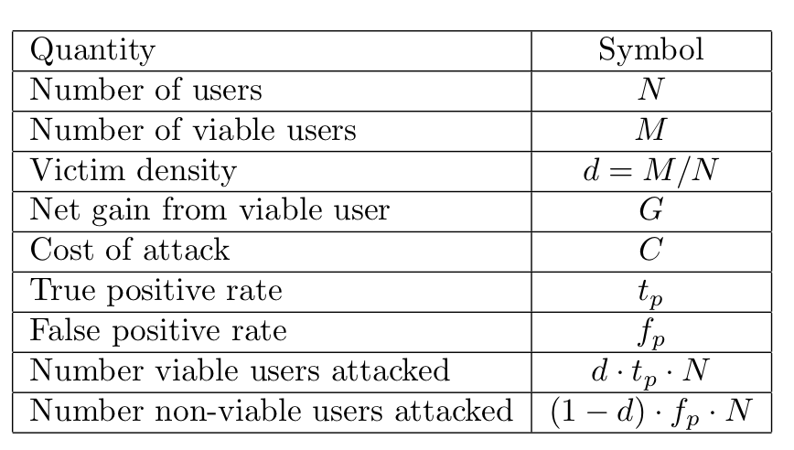

## Introducción {.flexbox .vcenter }
Nos referimos al artículo:

### Why do Nigerian Scammers Say They are from Nigeria?
Cormac Herley 

*Microsoft Researh*

## Why do Nigerian Scammers Say They are from Nigeria?  {.flexbox .vcenter}

## ROC {.flexbox .vcenter}

## Descipción {.flexbox .vcenter}

- Attackers have false positives too.
    - False positive are targets that are attacked but yield nothing.

   - False negatives are viable targets that go un-attacked.
  
    - Attacks as binary classification decisions.

## Descipción {.flexbox .vcenter}

- Attacks are seldom free.

    - Each potential target represents an investment decision to an attacker.
    
- Victim distribution model.

    - The attacker does not know with certainty that he will succeed unless he tries the attack.

    - Rich does not mean viable.
  
  $$ pdf(x|non-viable)=N(0,1)$$

$$pdf(x|viable)=N(\mu,1)$$

## Tabla de variables

##  Modelo  {.flexbox .vcenter}

- Attack model.

      -Attack if: $$P\{viable|x_i\}*G > P\{non viable|x_i\}*C$$

      -Expected return: $$\mathbb{E}[R] = (d  \cdot t_p  \cdot G - (1 - d)  f_p \cdot C)  N$$
      
  - Ability to discriminate between viable and non viable targets.
$$cdf(x|viable)  \ \mbox{vs.} \ cdf(x|non viable).$$

- Attack everyone, attack at random.

    - Expected return: $$\mathbb{E}[R] = (d \cdot G - (1 - d) \cdot C) \cdot N$$

## Modelo 

- Optimal Operating Point.
$$ \frac{1-d}{d} + \frac{C}{  G}$$

- As slope increases fewer users are attacked.

    - As slope increases not only are fewer total targets attacked, but fewer viable targets are attacked.

- If attacking everyone is not profitable slope must be greater than unity.
 $$ d >\frac{C}{  G + C} $$ 

## Distribuciones

## ROC S

## Pendiente vs $t_p$

## Planteamiento {.flexbox .vcenter}

*Thus, as slope increases not only are fewer total targets attacked, but fewer viable targets are attacked.*

## Nigerian Scam {.flexbox .vcenter}

## ¿Por qué los defraudadores dicen que son de Nigeria?

- Quién de ustedes abriría/respondería un correo que tiene en el título algo de Nigeria???? 

→ (seguramente nadie!) ¿por qué?

## Oportunidades en densidades de víctimas bajas

- Entrenar un buen clasificador requiere de muchos ejemplos etiquetados.

- Clasificadores con mayor precisión se construyen ‘fácilmente’ en dónde menos son requeridos (densidades grandes)

## ¿Cómo funciona?

- El que el correo sea tan obvio para saber que es spam cumple con su objetivo:  ocupar muy pocos recursos para disminuir el universo de FP y enfocarse en los posibles TP → los ingenuos.

## Utilizar los FP a nuestro favor

- Responder el correo sabiendo que están buscando víctimas

- Construir modelos que respondan automáticamente a estos correos 

