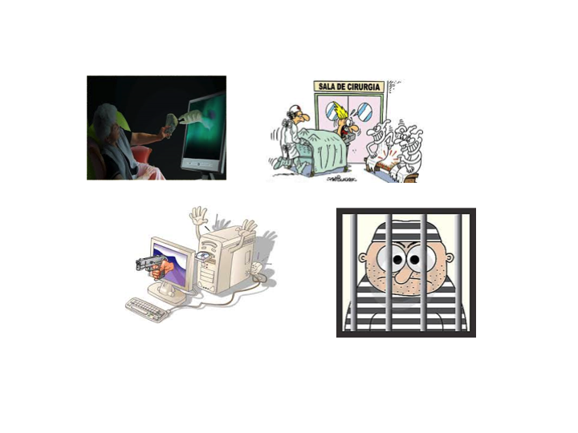
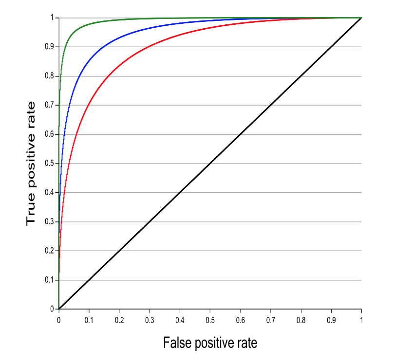
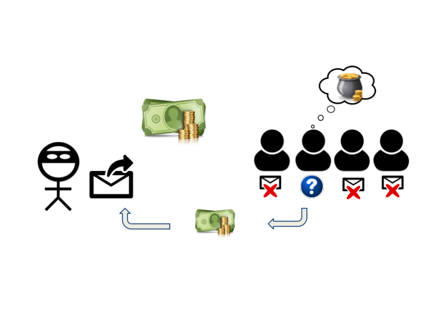

Introducción
------------

Nos referimos al artículo:

### Why do Nigerian Scammers Say They are from Nigeria?

Cormac Herley

*Microsoft Researh*

Why do Nigerian Scammers Say They are from Nigeria?
---------------------------------------------------

ROC
---

Descipción
----------

-   Attackers have false positives too.
    -   False positive are targets that are attacked but yield nothing.
-   False negatives are viable targets that go un-attacked.

    -   Attacks as binary classification decisions.

Descipción
----------

-   Attacks are seldom free.

    -   Each potential target represents an investment decision to an
        attacker.
-   Victim distribution model.

    -   The attacker does not know with certainty that he will succeed
        unless he tries the attack.

    -   Rich does not mean viable.

*p**d**f*(*x*∣*n**o**n* − *v**i**a**b**l**e*) = *N*(0, 1)

*p**d**f*(*x*∣*v**i**a**b**l**e*) = *N*(*μ*, 1)

Tabla de variables
------------------

Modelo
------

-   Attack model.

    -Attack if:
    *P*{*v**i**a**b**l**e*∣*x**i*} \* *G* \> *P*{*n**o**n**v**i**a**b**l**e*∣*x**i*} \* *C*

    -Expected return:
    E[*R*] = (*d* ⋅ *t**p* ⋅ *G* − (1 − *d*)*f**p* ⋅ *C*)*N*

-   Ability to discriminate between viable and non viable targets.
    *c**d**f*(*x*∣*v**i**a**b**l**e*) vs. *c**d**f*(*x*∣*n**o**n**v**i**a**b**l**e*).

-   Attack everyone, attack at random.

    -   Expected return:
        E[*R*] = (*d* ⋅ *G* − (1 − *d*) ⋅ *C*) ⋅ *N*

Modelo
------

-   Optimal Operating Point.
    \$\$ \\frac{1-d}{d} + \\frac{C}{  G}\$\$

-   As slope increases fewer users are attacked.

    -   As slope increases not only are fewer total targets attacked,
        but fewer viable targets are attacked.
-   If attacking everyone is not profitable slope must be greater than
    unity.
    \$\$ d \>\\frac{C}{  G + C} \$\$

Distribuciones
--------------

ROC S
-----

Pendiente vs *t**p*
------------------------------

Planteamiento
-------------

*Thus, as slope increases not only are fewer total targets attacked, but
fewer viable targets are attacked.*

Nigerian Scam
-------------

¿Por qué los defraudadores dicen que son de Nigeria?
----------------------------------------------------

-   Quién de ustedes abriría/respondería un correo que tiene en el
    título algo de Nigeria????

→ (seguramente nadie!) ¿por qué?

Oportunidades en densidades de víctimas bajas
---------------------------------------------

-   Entrenar un buen clasificador requiere de muchos ejemplos
    etiquetados.

-   Clasificadores con mayor precisión se construyen ‘fácilmente’ en
    dónde menos son requeridos (densidades grandes)

¿Cómo funciona?
---------------

-   El que el correo sea tan obvio para saber que es spam cumple con su
    objetivo: ocupar muy pocos recursos para disminuir el universo de FP
    y enfocarse en los posibles TP → los ingenuos.

Utilizar los FP a nuestro favor
-------------------------------

-   Responder el correo sabiendo que están buscando víctimas

-   Construir modelos que respondan automáticamente a estos correos
