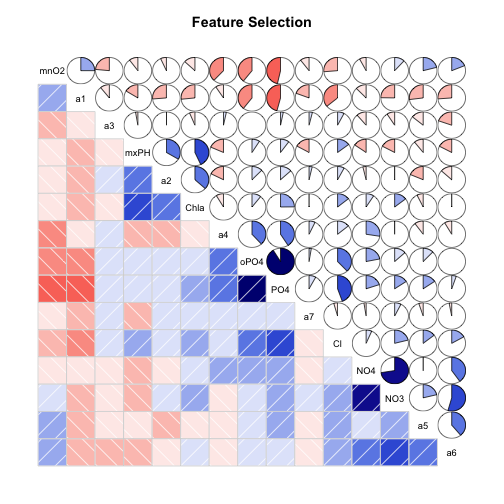

# Tarea:  Feature Selection . Funciones


### Low variability


```r
low.variability  <- function(df){
    options("scipen"=100, "digits"=4) # indico quitar expr cientifica
    quantile  <- apply(df, 2, FUN = quantile) # visualizo los quantiles
    IQR  <- apply(df,2,FUN=IQR) # visualizdo el IQR
    var  <- (apply(df,2,FUN=IQR) /
                 (apply(df,2,FUN=max)-apply(df,2,FUN=min)))*100 #IQR/rango
    tb  <- round(rbind(quantile,IQR,var),4)
    tb 
}

low.variability(algas.num)
```

```
##         mxPH   mnO2     Cl    NO3        NO4   oPO4    PO4    Chla    a1
## 0%    7.0000  1.500   0.80  0.050     5.8000   1.25   2.50   0.200  0.00
## 25%   7.7775  7.675  11.85  1.364    49.3750  18.56  50.34   2.075  1.40
## 50%   8.1000  9.750  35.08  2.820   115.7140  46.28 115.60   5.522  4.85
## 75%   8.4000 10.700  58.52  4.540   235.2500 102.83 220.25  18.308 19.32
## 100%  9.5000 13.400 391.50 45.650 24064.0000 564.60 771.60 110.456 89.80
## IQR   0.6225  3.025  46.66  3.176   185.8750  84.27 169.91  16.233 17.93
## var  24.9000 25.420  11.94  6.964     0.7726  14.96  22.09  14.723 19.96
##         a2     a3     a4    a5     a6     a7
## 0%    0.00  0.000  0.000  0.00  0.000  0.000
## 25%   0.00  0.000  0.000  0.00  0.000  0.000
## 50%   3.60  1.700  0.000  2.65  0.000  1.000
## 75%  11.70  5.525  2.425  8.00  7.975  2.700
## 100% 72.60 42.800 44.600 44.40 77.600 31.600
## IQR  11.70  5.525  2.425  8.00  7.975  2.700
## var  16.12 12.909  5.437 18.02 10.277  8.544
```


### Correlation Filtering


```r
correlation.filtering  <- function(df){
    require(corrgram)
    cor  <-  cor(df,use="complete.obs")
    corrgram(df, order=TRUE, lower.panel=panel.shade,
             upper.panel=panel.pie, text.panel=panel.txt,
             main="Feature Selection") 
    cor
    
}


correlation.filtering(algas.num)
```

 

```
##          mxPH     mnO2       Cl      NO3      NO4      oPO4      PO4
## mxPH  1.00000 -0.10269  0.14710 -0.17213 -0.15430  0.090229  0.10133
## mnO2 -0.10269  1.00000 -0.26325  0.11791 -0.07827 -0.393753 -0.46396
## Cl    0.14710 -0.26325  1.00000  0.21096  0.06598  0.379256  0.44519
## NO3  -0.17213  0.11791  0.21096  1.00000  0.72468  0.133015  0.15703
## NO4  -0.15430 -0.07827  0.06598  0.72468  1.00000  0.219311  0.19940
## oPO4  0.09023 -0.39375  0.37926  0.13301  0.21931  1.000000  0.91196
## PO4   0.10133 -0.46396  0.44519  0.15703  0.19940  0.911965  1.00000
## Chla  0.43182 -0.13122  0.14296  0.14549  0.09120  0.106915  0.24849
## a1   -0.16263  0.24998 -0.35924 -0.24724 -0.12361 -0.394574 -0.45817
## a2    0.33502 -0.06848  0.07845  0.01997 -0.03790  0.123811  0.13267
## a3   -0.02716 -0.23523  0.07653 -0.09182 -0.11290  0.005705  0.03219
## a4   -0.18435 -0.37983  0.14147 -0.01449  0.27452  0.382481  0.40884
## a5   -0.10731  0.21001  0.14535  0.21214  0.01544  0.122027  0.15549
## a6   -0.17274  0.18863  0.16904  0.54404  0.40119  0.003340  0.05320
## a7   -0.17027 -0.10455 -0.04495  0.07505 -0.02539  0.026150  0.07978
##          Chla       a1       a2        a3       a4       a5       a6
## mxPH  0.43182 -0.16263  0.33502 -0.027160 -0.18435 -0.10731 -0.17274
## mnO2 -0.13122  0.24998 -0.06848 -0.235228 -0.37983  0.21001  0.18863
## Cl    0.14296 -0.35924  0.07845  0.076530  0.14147  0.14535  0.16904
## NO3   0.14549 -0.24724  0.01997 -0.091822 -0.01449  0.21214  0.54404
## NO4   0.09120 -0.12361 -0.03790 -0.112905  0.27452  0.01544  0.40119
## oPO4  0.10691 -0.39457  0.12381  0.005705  0.38248  0.12203  0.00334
## PO4   0.24849 -0.45817  0.13267  0.032194  0.40884  0.15549  0.05320
## Chla  1.00000 -0.26601  0.36672 -0.063301 -0.08601 -0.07343  0.01033
## a1   -0.26601  1.00000 -0.26267 -0.108178 -0.09338 -0.26973 -0.26156
## a2    0.36672 -0.26267  1.00000  0.009760 -0.17629 -0.18676 -0.13352
## a3   -0.06330 -0.10818  0.00976  1.000000  0.03337 -0.14161 -0.19690
## a4   -0.08601 -0.09338 -0.17629  0.033369  1.00000 -0.10132 -0.08488
## a5   -0.07343 -0.26973 -0.18676 -0.141611 -0.10132  1.00000  0.38861
## a6    0.01033 -0.26156 -0.13352 -0.196900 -0.08488  0.38861  1.00000
## a7    0.01761 -0.19306  0.03621  0.039060  0.07115 -0.05149 -0.03033
##            a7
## mxPH -0.17027
## mnO2 -0.10455
## Cl   -0.04495
## NO3   0.07505
## NO4  -0.02539
## oPO4  0.02615
## PO4   0.07978
## Chla  0.01761
## a1   -0.19306
## a2    0.03621
## a3    0.03906
## a4    0.07115
## a5   -0.05149
## a6   -0.03033
## a7    1.00000
```


#### Fast correlation-based filtering (Algoritmo)


```r
FCB.filtering  <- function(df,regresada){
    # df dataframe numérica
    # regresada la variable objetivo
    df  <- as.data.frame(cor(df,use="complete.obs"))
    df[order(-abs(df[regresada,])),] 
}

FCB.filtering(algas.num,"mxPH") 
```

```
##          mxPH     mnO2       Cl      NO3      NO4      oPO4      PO4
## mxPH  1.00000 -0.10269  0.14710 -0.17213 -0.15430  0.090229  0.10133
## Chla  0.43182 -0.13122  0.14296  0.14549  0.09120  0.106915  0.24849
## a2    0.33502 -0.06848  0.07845  0.01997 -0.03790  0.123811  0.13267
## a4   -0.18435 -0.37983  0.14147 -0.01449  0.27452  0.382481  0.40884
## a6   -0.17274  0.18863  0.16904  0.54404  0.40119  0.003340  0.05320
## NO3  -0.17213  0.11791  0.21096  1.00000  0.72468  0.133015  0.15703
## a7   -0.17027 -0.10455 -0.04495  0.07505 -0.02539  0.026150  0.07978
## a1   -0.16263  0.24998 -0.35924 -0.24724 -0.12361 -0.394574 -0.45817
## NO4  -0.15430 -0.07827  0.06598  0.72468  1.00000  0.219311  0.19940
## Cl    0.14710 -0.26325  1.00000  0.21096  0.06598  0.379256  0.44519
## a5   -0.10731  0.21001  0.14535  0.21214  0.01544  0.122027  0.15549
## mnO2 -0.10269  1.00000 -0.26325  0.11791 -0.07827 -0.393753 -0.46396
## PO4   0.10133 -0.46396  0.44519  0.15703  0.19940  0.911965  1.00000
## oPO4  0.09023 -0.39375  0.37926  0.13301  0.21931  1.000000  0.91196
## a3   -0.02716 -0.23523  0.07653 -0.09182 -0.11290  0.005705  0.03219
##          Chla       a1       a2        a3       a4       a5       a6
## mxPH  0.43182 -0.16263  0.33502 -0.027160 -0.18435 -0.10731 -0.17274
## Chla  1.00000 -0.26601  0.36672 -0.063301 -0.08601 -0.07343  0.01033
## a2    0.36672 -0.26267  1.00000  0.009760 -0.17629 -0.18676 -0.13352
## a4   -0.08601 -0.09338 -0.17629  0.033369  1.00000 -0.10132 -0.08488
## a6    0.01033 -0.26156 -0.13352 -0.196900 -0.08488  0.38861  1.00000
## NO3   0.14549 -0.24724  0.01997 -0.091822 -0.01449  0.21214  0.54404
## a7    0.01761 -0.19306  0.03621  0.039060  0.07115 -0.05149 -0.03033
## a1   -0.26601  1.00000 -0.26267 -0.108178 -0.09338 -0.26973 -0.26156
## NO4   0.09120 -0.12361 -0.03790 -0.112905  0.27452  0.01544  0.40119
## Cl    0.14296 -0.35924  0.07845  0.076530  0.14147  0.14535  0.16904
## a5   -0.07343 -0.26973 -0.18676 -0.141611 -0.10132  1.00000  0.38861
## mnO2 -0.13122  0.24998 -0.06848 -0.235228 -0.37983  0.21001  0.18863
## PO4   0.24849 -0.45817  0.13267  0.032194  0.40884  0.15549  0.05320
## oPO4  0.10691 -0.39457  0.12381  0.005705  0.38248  0.12203  0.00334
## a3   -0.06330 -0.10818  0.00976  1.000000  0.03337 -0.14161 -0.19690
##            a7
## mxPH -0.17027
## Chla  0.01761
## a2    0.03621
## a4    0.07115
## a6   -0.03033
## NO3   0.07505
## a7    1.00000
## a1   -0.19306
## NO4  -0.02539
## Cl   -0.04495
## a5   -0.05149
## mnO2 -0.10455
## PO4   0.07978
## oPO4  0.02615
## a3    0.03906
```


### Forward Selection


```r
forward.select <- function(df, regresada,tipo){
    
    require(leaps)
    Vars <- setdiff(colnames(df),list(regresada))
    fullfeature <- paste(Vars, collapse="+")
    fullmodel<-lm(df[,regresada] ~.,data=na.omit(df))
    
    if( tipo == "forward"){
        step(lm(df[,regresada]~1,data=na.omit(df)),
             direction="forward",scope=paste("~",fullfeature))   
    }
    
    if(tipo == "backward"){
        step(fullmodel, direction = "backward" )   
    }
    
    if (tipo == "stepwise"){   
        step(fullmodel,direction="both") 
    }
}


forward.select(algas.num,"mxPH","forward")
```

```
## Start:  AIC=-275.5
## df[, regresada] ~ 1
## 
##        Df Sum of Sq  RSS  AIC
## + Chla  1      7.59 33.1 -312
## + a2    1      4.57 36.1 -295
## + a4    1      1.38 39.3 -280
## + a6    1      1.21 39.5 -279
## + NO3   1      1.21 39.5 -279
## + a7    1      1.18 39.5 -279
## + a1    1      1.08 39.6 -278
## + NO4   1      0.97 39.7 -278
## + Cl    1      0.88 39.8 -278
## + a5    1      0.47 40.2 -276
## <none>              40.7 -276
## + mnO2  1      0.43 40.3 -276
## + PO4   1      0.42 40.3 -275
## + oPO4  1      0.33 40.4 -275
## + a3    1      0.03 40.7 -274
## 
## Step:  AIC=-311.5
## df[, regresada] ~ Chla
## 
##        Df Sum of Sq  RSS  AIC
## + NO3   1     2.296 30.8 -323
## + NO4   1     1.540 31.6 -318
## + a2    1     1.468 31.7 -318
## + a7    1     1.289 31.8 -317
## + a6    1     1.279 31.8 -317
## + a4    1     0.889 32.2 -314
## <none>              33.1 -311
## + Cl    1     0.303 32.8 -311
## + a5    1     0.234 32.9 -311
## + a1    1     0.100 33.0 -310
## + mnO2  1     0.088 33.0 -310
## + oPO4  1     0.080 33.0 -310
## + PO4   1     0.002 33.1 -309
## + a3    1     0.000 33.1 -309
## 
## Step:  AIC=-322.7
## df[, regresada] ~ Chla + NO3
## 
##        Df Sum of Sq  RSS  AIC
## + a2    1     1.340 29.5 -329
## + a7    1     1.055 29.8 -327
## + a4    1     0.895 29.9 -326
## + Cl    1     0.741 30.1 -325
## + a1    1     0.440 30.4 -323
## <none>              30.8 -323
## + oPO4  1     0.218 30.6 -322
## + a6    1     0.128 30.7 -321
## + NO4   1     0.045 30.8 -321
## + PO4   1     0.023 30.8 -321
## + a5    1     0.021 30.8 -321
## + a3    1     0.016 30.8 -321
## + mnO2  1     0.007 30.8 -321
## 
## Step:  AIC=-328.9
## df[, regresada] ~ Chla + NO3 + a2
## 
##        Df Sum of Sq  RSS  AIC
## + a7    1     1.140 28.4 -334
## + Cl    1     0.672 28.8 -331
## + a4    1     0.600 28.9 -331
## <none>              29.5 -329
## + a1    1     0.197 29.3 -328
## + oPO4  1     0.127 29.4 -328
## + a6    1     0.034 29.5 -327
## + a3    1     0.027 29.5 -327
## + NO4   1     0.016 29.5 -327
## + PO4   1     0.009 29.5 -327
## + mnO2  1     0.004 29.5 -327
## + a5    1     0.003 29.5 -327
## 
## Step:  AIC=-334.1
## df[, regresada] ~ Chla + NO3 + a2 + a7
## 
##        Df Sum of Sq  RSS  AIC
## + Cl    1     0.566 27.8 -336
## + a4    1     0.478 27.9 -335
## + a1    1     0.421 27.9 -335
## <none>              28.4 -334
## + oPO4  1     0.137 28.2 -333
## + a6    1     0.073 28.3 -333
## + NO4   1     0.063 28.3 -333
## + mnO2  1     0.036 28.3 -332
## + PO4   1     0.028 28.3 -332
## + a3    1     0.013 28.3 -332
## + a5    1     0.000 28.4 -332
## 
## Step:  AIC=-335.9
## df[, regresada] ~ Chla + NO3 + a2 + a7 + Cl
## 
##        Df Sum of Sq  RSS  AIC
## + a4    1     0.696 27.1 -339
## <none>              27.8 -336
## + a1    1     0.183 27.6 -335
## + a6    1     0.109 27.7 -335
## + a3    1     0.039 27.7 -334
## + PO4   1     0.027 27.8 -334
## + NO4   1     0.023 27.8 -334
## + a5    1     0.012 27.8 -334
## + oPO4  1     0.012 27.8 -334
## + mnO2  1     0.001 27.8 -334
## 
## Step:  AIC=-338.5
## df[, regresada] ~ Chla + NO3 + a2 + a7 + Cl + a4
## 
##        Df Sum of Sq  RSS  AIC
## <none>              27.1 -339
## + a1    1    0.2635 26.8 -338
## + oPO4  1    0.2240 26.9 -338
## + a6    1    0.2014 26.9 -338
## + mnO2  1    0.0895 27.0 -337
## + NO4   1    0.0659 27.0 -337
## + a5    1    0.0624 27.0 -337
## + PO4   1    0.0487 27.0 -337
## + a3    1    0.0352 27.1 -337
```


### Epsilon


Es una función que nos permite visualizar la pertenencia o correlación de los rasgos de una variable con respecto a la variable objetivo.

Lo que se quiere es contrastar la probabilidad condicional de las categorías de la variable x (ejemplo  variable: género con categorías: hombre y mujer) contra la probabilidad de la objetivo (objetivo: 0 o 1).

$P(C|X) − P ©$.

— En el texto se propone para las variable categóricas realizarlo por una prueba binomial Épsilon y para las variables métricas (entiendo que es la numérica) una prueba t.


La prueba binomial (no encontré binomial épsilon) :
binom.test(x, n, p = 0.5,
           alternative = c("two.sided", "less", "greater"),
           conf.level = 0.95)

La prueba t:
t.test(x, ...)


Aun no logro entender qué debe arrojar al final la función… por lo que empece a trabajar sólo en tranformar el dataframe en sus probabilidades condicionales.


Avances:


```r
epsilon  <- function(df, n){
    # n = nombre de la columna objetivo, debe estar en 0 y 1.
    
    require(plyr)
    
    ncol  <- colnames(df)
    ncol  <- ncol[ncol != n]
    
    for (col in ncol){
        if (class(df[,col]) == "factor"){
     
            data0  <- df[df$n %in% 0,]  
            names0  <-  unique(data0[col])
            data1  <-  df[df$n %in% 1,]
            names1  <- unique(data1[col])
            values0  <- c()
            values1  <- c()
         
            for (i in names0){   
            values0  <- as.vector(cbind(values0, nrow(data0[data0$col %in% i,]) / nrow(data0[col])) ) 
        }
        
            for (i in names1){
            values1  <- as.vector(cbind(values1,nrow(data1[data1$col %in% i,])/ nrow(data1[col])))
        }

            vec  <- c()
            for (i in 1:nrow(df[col])){
            
                if (df[i,n] == 0){    
                vec <- rbind(vec,mapvalues(as.factor(df[i,col]), from=as.vector(names0),to=as.vector(values0),warn_missing=F))
                }
                else{    
                vec <- rbind(vec,mapvalues(as.factor(df[i,col]), from=as.vector(names1),to=as.vector(values1),warn_missing=F))
                }
            }
        
        df$col  <- as.vector(vec)
        
            }
        
        else{
           
            data0  <-  df[df$n %in% 0,]
            data1  <-  df[df$n %in% 1,]
            vec  <- c()
            
            for (i in 1:nrow(df[col])){
                
                if (df[i,n] == 0){   

                    vec <- rbind(vec,5)#(1/(2*3.14*var(data0[,col],na.rm = T))^.5)*exp((-1*((df$col[i]-mean(data0[,col],na.rm = T))^2))/(2*var(data0[,col],na.rm = T)))
                }
                else{
                    vec <- rbind(vec,6)#(1/(2*3.14*var(data1[,col],na.rm = T))^.5)*exp((-1*((df$col[i]-mean(data1[,col],na.rm = T))^2))/(2*var(data1[,col],na.rm = T)))
            }
        }
        df$col  <- as.vector(vec)
        
        }
        }
        }
```


