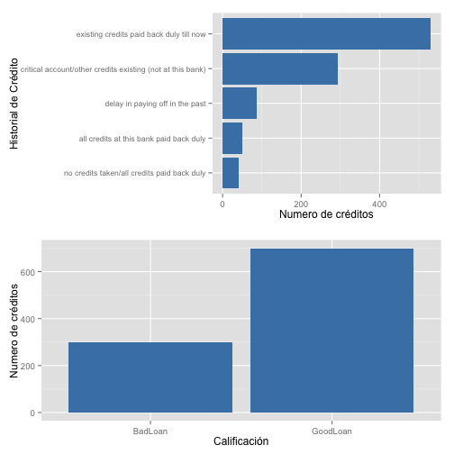
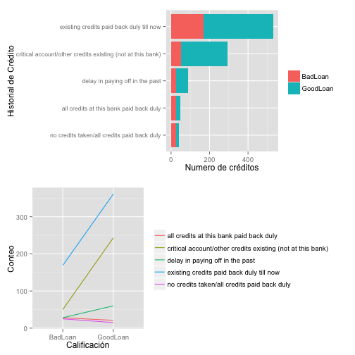

# DataMining: Exploración de datos GERMAN BANK


```r
#Cargando recursos para realizar el análisis

source("0-load.r")
source("1-prepare.r")
```

```
## 
## Attaching package: 'dplyr'
## 
## The following objects are masked from 'package:plyr':
## 
##     arrange, count, desc, failwith, id, mutate, rename, summarise,
##     summarize
## 
## The following object is masked from 'package:stats':
## 
##     filter
## 
## The following objects are masked from 'package:base':
## 
##     intersect, setdiff, setequal, union
```

```r
source("metadata.r")

library(ggplot2)
library(gridExtra)
```

```
## Loading required package: grid
```

### Carga y limpieza de datos


```r
# carga de datos con función definida en 0-load.r
german.data  <-  load()

# Reasigando nombre de las columnas trabajadas en metada.r (letras en minículas y sustituyendo la digonal y espacios en blanco por un punto)
colnames(german.data) <- german.colnames

#haciendo factor a la columna good.loan
german.data$good.loan <- as.factor(
    ifelse(
        german.data$good.loan == 1, 
        'GoodLoan', 
        'BadLoan'
    )
)
```

Codifciando los valores de las columnas


```
## The following `from` values were not present in `x`: A30, A31, A32, A33, A34, A40, A41, A42, A43, A44, A45, A46, A47, A48, A49, A410, A61, A62, A63, A64, A65, A71, A72, A73, A74, A75, A91, A92, A93, A94, A95, A101, A102, A103, A121, A122, A123, A124, A141, A142, A143, A151, A152, A153, A171, A172, A173, A174, A191, A192, A201, A202
## The following `from` values were not present in `x`: A11, A12, A13, A14, A30, A31, A32, A33, A34, A40, A41, A42, A43, A44, A45, A46, A47, A48, A49, A410, A61, A62, A63, A64, A65, A71, A72, A73, A74, A75, A91, A92, A93, A94, A95, A101, A102, A103, A121, A122, A123, A124, A141, A142, A143, A151, A152, A153, A171, A172, A173, A174, A191, A192, A201, A202
## The following `from` values were not present in `x`: A11, A12, A13, A14, A40, A41, A42, A43, A44, A45, A46, A47, A48, A49, A410, A61, A62, A63, A64, A65, A71, A72, A73, A74, A75, A91, A92, A93, A94, A95, A101, A102, A103, A121, A122, A123, A124, A141, A142, A143, A151, A152, A153, A171, A172, A173, A174, A191, A192, A201, A202
## The following `from` values were not present in `x`: A11, A12, A13, A14, A30, A31, A32, A33, A34, A47, A61, A62, A63, A64, A65, A71, A72, A73, A74, A75, A91, A92, A93, A94, A95, A101, A102, A103, A121, A122, A123, A124, A141, A142, A143, A151, A152, A153, A171, A172, A173, A174, A191, A192, A201, A202
## The following `from` values were not present in `x`: A11, A12, A13, A14, A30, A31, A32, A33, A34, A40, A41, A42, A43, A44, A45, A46, A47, A48, A49, A410, A61, A62, A63, A64, A65, A71, A72, A73, A74, A75, A91, A92, A93, A94, A95, A101, A102, A103, A121, A122, A123, A124, A141, A142, A143, A151, A152, A153, A171, A172, A173, A174, A191, A192, A201, A202
## The following `from` values were not present in `x`: A11, A12, A13, A14, A30, A31, A32, A33, A34, A40, A41, A42, A43, A44, A45, A46, A47, A48, A49, A410, A71, A72, A73, A74, A75, A91, A92, A93, A94, A95, A101, A102, A103, A121, A122, A123, A124, A141, A142, A143, A151, A152, A153, A171, A172, A173, A174, A191, A192, A201, A202
## The following `from` values were not present in `x`: A11, A12, A13, A14, A30, A31, A32, A33, A34, A40, A41, A42, A43, A44, A45, A46, A47, A48, A49, A410, A61, A62, A63, A64, A65, A91, A92, A93, A94, A95, A101, A102, A103, A121, A122, A123, A124, A141, A142, A143, A151, A152, A153, A171, A172, A173, A174, A191, A192, A201, A202
## The following `from` values were not present in `x`: A11, A12, A13, A14, A30, A31, A32, A33, A34, A40, A41, A42, A43, A44, A45, A46, A47, A48, A49, A410, A61, A62, A63, A64, A65, A71, A72, A73, A74, A75, A91, A92, A93, A94, A95, A101, A102, A103, A121, A122, A123, A124, A141, A142, A143, A151, A152, A153, A171, A172, A173, A174, A191, A192, A201, A202
## The following `from` values were not present in `x`: A11, A12, A13, A14, A30, A31, A32, A33, A34, A40, A41, A42, A43, A44, A45, A46, A47, A48, A49, A410, A61, A62, A63, A64, A65, A71, A72, A73, A74, A75, A95, A101, A102, A103, A121, A122, A123, A124, A141, A142, A143, A151, A152, A153, A171, A172, A173, A174, A191, A192, A201, A202
## The following `from` values were not present in `x`: A11, A12, A13, A14, A30, A31, A32, A33, A34, A40, A41, A42, A43, A44, A45, A46, A47, A48, A49, A410, A61, A62, A63, A64, A65, A71, A72, A73, A74, A75, A91, A92, A93, A94, A95, A121, A122, A123, A124, A141, A142, A143, A151, A152, A153, A171, A172, A173, A174, A191, A192, A201, A202
## The following `from` values were not present in `x`: A11, A12, A13, A14, A30, A31, A32, A33, A34, A40, A41, A42, A43, A44, A45, A46, A47, A48, A49, A410, A61, A62, A63, A64, A65, A71, A72, A73, A74, A75, A91, A92, A93, A94, A95, A101, A102, A103, A121, A122, A123, A124, A141, A142, A143, A151, A152, A153, A171, A172, A173, A174, A191, A192, A201, A202
## The following `from` values were not present in `x`: A11, A12, A13, A14, A30, A31, A32, A33, A34, A40, A41, A42, A43, A44, A45, A46, A47, A48, A49, A410, A61, A62, A63, A64, A65, A71, A72, A73, A74, A75, A91, A92, A93, A94, A95, A101, A102, A103, A141, A142, A143, A151, A152, A153, A171, A172, A173, A174, A191, A192, A201, A202
## The following `from` values were not present in `x`: A11, A12, A13, A14, A30, A31, A32, A33, A34, A40, A41, A42, A43, A44, A45, A46, A47, A48, A49, A410, A61, A62, A63, A64, A65, A71, A72, A73, A74, A75, A91, A92, A93, A94, A95, A101, A102, A103, A121, A122, A123, A124, A141, A142, A143, A151, A152, A153, A171, A172, A173, A174, A191, A192, A201, A202
## The following `from` values were not present in `x`: A11, A12, A13, A14, A30, A31, A32, A33, A34, A40, A41, A42, A43, A44, A45, A46, A47, A48, A49, A410, A61, A62, A63, A64, A65, A71, A72, A73, A74, A75, A91, A92, A93, A94, A95, A101, A102, A103, A121, A122, A123, A124, A151, A152, A153, A171, A172, A173, A174, A191, A192, A201, A202
## The following `from` values were not present in `x`: A11, A12, A13, A14, A30, A31, A32, A33, A34, A40, A41, A42, A43, A44, A45, A46, A47, A48, A49, A410, A61, A62, A63, A64, A65, A71, A72, A73, A74, A75, A91, A92, A93, A94, A95, A101, A102, A103, A121, A122, A123, A124, A141, A142, A143, A171, A172, A173, A174, A191, A192, A201, A202
## The following `from` values were not present in `x`: A11, A12, A13, A14, A30, A31, A32, A33, A34, A40, A41, A42, A43, A44, A45, A46, A47, A48, A49, A410, A61, A62, A63, A64, A65, A71, A72, A73, A74, A75, A91, A92, A93, A94, A95, A101, A102, A103, A121, A122, A123, A124, A141, A142, A143, A151, A152, A153, A171, A172, A173, A174, A191, A192, A201, A202
## The following `from` values were not present in `x`: A11, A12, A13, A14, A30, A31, A32, A33, A34, A40, A41, A42, A43, A44, A45, A46, A47, A48, A49, A410, A61, A62, A63, A64, A65, A71, A72, A73, A74, A75, A91, A92, A93, A94, A95, A101, A102, A103, A121, A122, A123, A124, A141, A142, A143, A151, A152, A153, A191, A192, A201, A202
## The following `from` values were not present in `x`: A11, A12, A13, A14, A30, A31, A32, A33, A34, A40, A41, A42, A43, A44, A45, A46, A47, A48, A49, A410, A61, A62, A63, A64, A65, A71, A72, A73, A74, A75, A91, A92, A93, A94, A95, A101, A102, A103, A121, A122, A123, A124, A141, A142, A143, A151, A152, A153, A171, A172, A173, A174, A191, A192, A201, A202
## The following `from` values were not present in `x`: A11, A12, A13, A14, A30, A31, A32, A33, A34, A40, A41, A42, A43, A44, A45, A46, A47, A48, A49, A410, A61, A62, A63, A64, A65, A71, A72, A73, A74, A75, A91, A92, A93, A94, A95, A101, A102, A103, A121, A122, A123, A124, A141, A142, A143, A151, A152, A153, A171, A172, A173, A174, A201, A202
## The following `from` values were not present in `x`: A11, A12, A13, A14, A30, A31, A32, A33, A34, A40, A41, A42, A43, A44, A45, A46, A47, A48, A49, A410, A61, A62, A63, A64, A65, A71, A72, A73, A74, A75, A91, A92, A93, A94, A95, A101, A102, A103, A121, A122, A123, A124, A141, A142, A143, A151, A152, A153, A171, A172, A173, A174, A191, A192
## The following `from` values were not present in `x`: A11, A12, A13, A14, A30, A31, A32, A33, A34, A40, A41, A42, A43, A44, A45, A46, A47, A48, A49, A410, A61, A62, A63, A64, A65, A71, A72, A73, A74, A75, A91, A92, A93, A94, A95, A101, A102, A103, A121, A122, A123, A124, A141, A142, A143, A151, A152, A153, A171, A172, A173, A174, A191, A192, A201, A202
```


### Exploración: Relación entre el historial crediticio (credit.history) y  la calificación del acreditado (good.loan)

Primera visualización


```r
# visualización de credit.history
credit.history.df  <- german.data %>%
    group_by(credit.history) %>%
    summarise(count = n()) %>%
    arrange(desc(count))

g1  <- ggplot(credit.history.df, aes(x= reorder(credit.history,count), y=count)) + 
    geom_bar(stat="identity", fill="steelblue") + 
    coord_flip() + 
    theme(axis.text.y=element_text(size=rel(0.9)))+
    xlab("Historial de Crédito") + ylab("Numero de créditos")

# visualizando good.loan

good.loan.df  <-  german.data %>%
    count(good.loan)

g2  <- ggplot(good.loan.df, aes(x= reorder(good.loan,n), y=n)) + 
    geom_bar(stat="identity", fill="steelblue")+
    xlab("Calificación") + ylab("Numero de créditos")

# visualizando 
grid.arrange(g1, g2, nrow=2)
```

 

Segunda visualización


```r
# Visualización combinando las 2 variables

credit.good.loan  <- german.data %>%
    group_by(credit.history,good.loan) %>%
    summarise(count = n())

g3  <- ggplot(credit.good.loan, aes(x= reorder(credit.history,count), y=count, fill = good.loan)) + 
    geom_bar(stat="identity") + 
    coord_flip() + 
    theme(axis.text.y=element_text(size=rel(0.9)),legend.title=element_blank())+
    xlab("Historial de Crédito") + ylab("Numero de créditos")

# g4  <- ggplot(credit.good.loan, aes(x = reorder(credit.history,count), y = count)) + 
#     geom_bar(stat = "identity", fill = "steelblue") +
#     facet_wrap(~ good.loan) +
#     xlab("Historial de Crédito") + ylab("Numero de créditos") + 
#     theme(axis.text.x = element_text(angle = 90,size=14))+ 
#     coord_flip()

g5  <- ggplot(credit.good.loan, aes(x = good.loan, y = count, color =credit.history, group=credit.history)) +
    geom_line()+
    xlab("Calificación") + ylab("Conteo")+
    theme(legend.title=element_blank())

grid.arrange(g3, g5, nrow=2)
```

 


## Conclusiones:

Hasta este momento no tenemos suficiente información para dar una recomendación concreta con respecto a mejorar en 10% la situación de los créditos para disminuir la perdida de malos créditos.
Sin embargo en estas primeras visualizaciones podemos observar que 1/3 de los creditos solicitados por clientes que han pagado bien son calificados como malos similar en proporción a los créditos solicitados por clientes que han tenido retraso en sus pagos.

