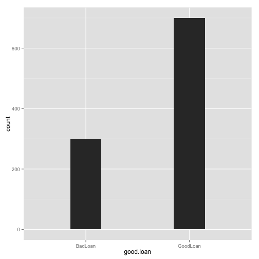

# Introducción

El archivo se obtuvo del repositorio UCI Machine Learning Repository. Con URL:
'http://archive.ics.uci.edu/ml/machine-learning-databases/statlog'/german/german.data'


## Variables

Se tiene una dataset con 21 variables y 1000 observaciones. De las cuales 7 variables son numéricas y el resto son categóricas.


# Estructura General


```r
ds
```

```
## Source: local data frame [1,000 x 21]
## 
##    status.of.existing.checking.account duration.in.month
## 1                           ... < 0 DM                 6
## 2                    0 <= ... < 200 DM                48
## 3                  no checking account                12
## 4                           ... < 0 DM                42
## 5                           ... < 0 DM                24
## 6                  no checking account                36
## 7                  no checking account                24
## 8                    0 <= ... < 200 DM                36
## 9                  no checking account                12
## 10                   0 <= ... < 200 DM                30
## ..                                 ...               ...
## Variables not shown: credit.history (fctr), purpose (fctr), credit.amount
##   (dbl), savings.account.bonds (fctr), present.employment.since (fctr),
##   installment.rate.in.percentage.of.disposable.income (dbl),
##   personal.status.and.sex (fctr), other.debtors...guarantors (fctr),
##   present.residence.since (dbl), property (fctr), age.in.years (dbl),
##   other.installment.plans (fctr), housing (fctr),
##   number.of.existing.credits.at.this.bank (dbl), job (fctr),
##   number.of.people.being.liable.to.provide.maintenance.for (dbl),
##   telephone (fctr), foreign.worker (fctr), good.loan (fctr)
```


## Tamaño

```r
dim(ds)
```

```
## [1] 1000   21
```

## Columnas


```r
names(ds)
```

```
##  [1] "status.of.existing.checking.account"                     
##  [2] "duration.in.month"                                       
##  [3] "credit.history"                                          
##  [4] "purpose"                                                 
##  [5] "credit.amount"                                           
##  [6] "savings.account.bonds"                                   
##  [7] "present.employment.since"                                
##  [8] "installment.rate.in.percentage.of.disposable.income"     
##  [9] "personal.status.and.sex"                                 
## [10] "other.debtors...guarantors"                              
## [11] "present.residence.since"                                 
## [12] "property"                                                
## [13] "age.in.years"                                            
## [14] "other.installment.plans"                                 
## [15] "housing"                                                 
## [16] "number.of.existing.credits.at.this.bank"                 
## [17] "job"                                                     
## [18] "number.of.people.being.liable.to.provide.maintenance.for"
## [19] "telephone"                                               
## [20] "foreign.worker"                                          
## [21] "good.loan"
```

## Estructura


```r
str(ds)
```

```
## Classes 'tbl_df', 'tbl' and 'data.frame':	1000 obs. of  21 variables:
##  $ status.of.existing.checking.account                     : Factor w/ 4 levels "... < 0 DM","0 <= ... < 200 DM",..: 1 2 4 1 1 4 4 2 4 2 ...
##  $ duration.in.month                                       : num  6 48 12 42 24 36 24 36 12 30 ...
##  $ credit.history                                          : Factor w/ 5 levels "no credits taken/all credits paid back duly",..: 5 3 5 3 4 3 3 3 3 5 ...
##  $ purpose                                                 : Factor w/ 10 levels "car (new)","car (used)",..: 5 5 8 4 1 8 4 2 5 1 ...
##  $ credit.amount                                           : num  1169 5951 2096 7882 4870 ...
##  $ savings.account.bonds                                   : Factor w/ 5 levels "... < 100 DM",..: 5 1 1 1 1 5 3 1 4 1 ...
##  $ present.employment.since                                : Factor w/ 5 levels "unemployed","... < 1 year",..: 5 3 4 4 3 3 5 3 4 1 ...
##  $ installment.rate.in.percentage.of.disposable.income     : num  4 2 2 2 3 2 3 2 2 4 ...
##  $ personal.status.and.sex                                 : Factor w/ 4 levels "male : divorced/separated",..: 3 2 3 3 3 3 3 3 1 4 ...
##  $ other.debtors...guarantors                              : Factor w/ 3 levels "none","co-applicant",..: 1 1 1 3 1 1 1 1 1 1 ...
##  $ present.residence.since                                 : num  4 2 3 4 4 4 4 2 4 2 ...
##  $ property                                                : Factor w/ 4 levels "real estate",..: 1 1 1 2 4 4 2 3 1 3 ...
##  $ age.in.years                                            : num  67 22 49 45 53 35 53 35 61 28 ...
##  $ other.installment.plans                                 : Factor w/ 3 levels "bank","stores",..: 3 3 3 3 3 3 3 3 3 3 ...
##  $ housing                                                 : Factor w/ 3 levels "rent","own","for free": 2 2 2 3 3 3 2 1 2 2 ...
##  $ number.of.existing.credits.at.this.bank                 : num  2 1 1 1 2 1 1 1 1 2 ...
##  $ job                                                     : Factor w/ 4 levels "unemployed/ unskilled - non-resident",..: 3 3 2 3 3 2 3 4 2 4 ...
##  $ number.of.people.being.liable.to.provide.maintenance.for: num  1 1 2 2 2 2 1 1 1 1 ...
##  $ telephone                                               : Factor w/ 2 levels "none","yes, registered under the customers name": 2 1 1 1 1 2 1 2 1 1 ...
##  $ foreign.worker                                          : Factor w/ 2 levels "yes","no": 1 1 1 1 1 1 1 1 1 1 ...
##  $ good.loan                                               : Factor w/ 2 levels "BadLoan","GoodLoan": 2 1 2 2 1 2 2 2 2 1 ...
```

_NOTA: Indicar si hay una discrepancia entre las clases de las variables en el data set y en su significado, i.e. fechas que no son fechas, si no factores, etc._

## Observaciones


```r
head(ds)
```

```
## Source: local data frame [6 x 21]
## 
##   status.of.existing.checking.account duration.in.month
## 1                          ... < 0 DM                 6
## 2                   0 <= ... < 200 DM                48
## 3                 no checking account                12
## 4                          ... < 0 DM                42
## 5                          ... < 0 DM                24
## 6                 no checking account                36
## Variables not shown: credit.history (fctr), purpose (fctr), credit.amount
##   (dbl), savings.account.bonds (fctr), present.employment.since (fctr),
##   installment.rate.in.percentage.of.disposable.income (dbl),
##   personal.status.and.sex (fctr), other.debtors...guarantors (fctr),
##   present.residence.since (dbl), property (fctr), age.in.years (dbl),
##   other.installment.plans (fctr), housing (fctr),
##   number.of.existing.credits.at.this.bank (dbl), job (fctr),
##   number.of.people.being.liable.to.provide.maintenance.for (dbl),
##   telephone (fctr), foreign.worker (fctr), good.loan (fctr)
```


```r
tail(ds)
```

```
## Source: local data frame [6 x 21]
## 
##   status.of.existing.checking.account duration.in.month
## 1                 no checking account                12
## 2                 no checking account                12
## 3                          ... < 0 DM                30
## 4                 no checking account                12
## 5                          ... < 0 DM                45
## 6                   0 <= ... < 200 DM                45
## Variables not shown: credit.history (fctr), purpose (fctr), credit.amount
##   (dbl), savings.account.bonds (fctr), present.employment.since (fctr),
##   installment.rate.in.percentage.of.disposable.income (dbl),
##   personal.status.and.sex (fctr), other.debtors...guarantors (fctr),
##   present.residence.since (dbl), property (fctr), age.in.years (dbl),
##   other.installment.plans (fctr), housing (fctr),
##   number.of.existing.credits.at.this.bank (dbl), job (fctr),
##   number.of.people.being.liable.to.provide.maintenance.for (dbl),
##   telephone (fctr), foreign.worker (fctr), good.loan (fctr)
```


# Sumario Estadístico


```r
summary(ds)
```

```
##                                      status.of.existing.checking.account
##  ... < 0 DM                                            :274             
##  0 <= ... < 200 DM                                     :269             
##  ... >= 200 DM / salary assignments for at least 1 year: 63             
##  no checking account                                   :394             
##                                                                         
##                                                                         
##                                                                         
##  duration.in.month
##  Min.   : 4.0     
##  1st Qu.:12.0     
##  Median :18.0     
##  Mean   :20.9     
##  3rd Qu.:24.0     
##  Max.   :72.0     
##                   
##                                                     credit.history
##  no credits taken/all credits paid back duly               : 40   
##  all credits at this bank paid back duly                   : 49   
##  existing credits paid back duly till now                  :530   
##  delay in paying off in the past                           : 88   
##  critical account/other credits existing (not at this bank):293   
##                                                                   
##                                                                   
##                 purpose    credit.amount  
##  radio/television   :280   Min.   :  250  
##  car (new)          :234   1st Qu.: 1366  
##  furniture/equipment:181   Median : 2320  
##  car (used)         :103   Mean   : 3271  
##  business           : 97   3rd Qu.: 3972  
##  education          : 50   Max.   :18424  
##  (Other)            : 55                  
##                  savings.account.bonds       present.employment.since
##  ... < 100 DM               :603       unemployed        : 62        
##  100 <= ... < 500 DM        :103       ... < 1 year      :172        
##  500 <= ... < 1000 DM       : 63       1 <= ... < 4 years:339        
##  .. >= 1000 DM              : 48       4 <= ... < 7 years:174        
##  unknown/ no savings account:183       .. >= 7 years     :253        
##                                                                      
##                                                                      
##  installment.rate.in.percentage.of.disposable.income
##  Min.   :1.00                                       
##  1st Qu.:2.00                                       
##  Median :3.00                                       
##  Mean   :2.97                                       
##  3rd Qu.:4.00                                       
##  Max.   :4.00                                       
##                                                     
##                         personal.status.and.sex other.debtors...guarantors
##  male : divorced/separated          : 50        none        :907          
##  female : divorced/separated/married:310        co-applicant: 41          
##  male : single                      :548        guarantor   : 52          
##  male : married/widowed             : 92                                  
##                                                                           
##                                                                           
##                                                                           
##  present.residence.since
##  Min.   :1.00           
##  1st Qu.:2.00           
##  Median :3.00           
##  Mean   :2.85           
##  3rd Qu.:4.00           
##  Max.   :4.00           
##                         
##                                                             property  
##  real estate                                                    :282  
##  if not A121 : building society savings agreement/life insurance:232  
##  if not A121/A122 : car or other, not in attribute 6            :332  
##  unknown / no property                                          :154  
##                                                                       
##                                                                       
##                                                                       
##   age.in.years  other.installment.plans     housing   
##  Min.   :19.0   bank  :139              rent    :179  
##  1st Qu.:27.0   stores: 47              own     :713  
##  Median :33.0   none  :814              for free:108  
##  Mean   :35.5                                         
##  3rd Qu.:42.0                                         
##  Max.   :75.0                                         
##                                                       
##  number.of.existing.credits.at.this.bank
##  Min.   :1.00                           
##  1st Qu.:1.00                           
##  Median :1.00                           
##  Mean   :1.41                           
##  3rd Qu.:2.00                           
##  Max.   :4.00                           
##                                         
##                                                            job     
##  unemployed/ unskilled - non-resident                        : 22  
##  unskilled - resident                                        :200  
##  skilled employee / official                                 :630  
##  management/ self-employed/highly qualified employee/ officer:148  
##                                                                    
##                                                                    
##                                                                    
##  number.of.people.being.liable.to.provide.maintenance.for
##  Min.   :1.00                                            
##  1st Qu.:1.00                                            
##  Median :1.00                                            
##  Mean   :1.16                                            
##  3rd Qu.:1.00                                            
##  Max.   :2.00                                            
##                                                          
##                                     telephone   foreign.worker
##  none                                    :596   yes:963       
##  yes, registered under the customers name:404   no : 37       
##                                                               
##                                                               
##                                                               
##                                                               
##                                                               
##     good.loan  
##  BadLoan :300  
##  GoodLoan:700  
##                
##                
##                
##                
## 
```


# Limpieza de metadatos


```r
source("utils.r")
```

```
## -------------------------------------------------------------------------
## You have loaded plyr after dplyr - this is likely to cause problems.
## If you need functions from both plyr and dplyr, please load plyr first, then dplyr:
## library(plyr); library(dplyr)
## -------------------------------------------------------------------------
## 
## Attaching package: 'plyr'
## 
## The following object is masked from 'package:lubridate':
## 
##     here
## 
## The following objects are masked from 'package:dplyr':
## 
##     arrange, count, desc, failwith, id, mutate, rename, summarise,
##     summarize
```

```r
# Usaremos la función que hiciste de ejercicio
names(ds) <- normalizarNombres(names(ds))
```


```r
names(ds)
```

```
##  [1] "status.of.existing.checking.account"                     
##  [2] "duration.in.month"                                       
##  [3] "credit.history"                                          
##  [4] "purpose"                                                 
##  [5] "credit.amount"                                           
##  [6] "savings.account.bonds"                                   
##  [7] "present.employment.since"                                
##  [8] "installment.rate.in.percentage.of.disposable.income"     
##  [9] "personal.status.and.sex"                                 
## [10] "other.debtors...guarantors"                              
## [11] "present.residence.since"                                 
## [12] "property"                                                
## [13] "age.in.years"                                            
## [14] "other.installment.plans"                                 
## [15] "housing"                                                 
## [16] "number.of.existing.credits.at.this.bank"                 
## [17] "job"                                                     
## [18] "number.of.people.being.liable.to.provide.maintenance.for"
## [19] "telephone"                                               
## [20] "foreign.worker"                                          
## [21] "good.loan"
```

# Ajuste de formatos

Las clases de las variables son


```r
sapply(ds, class)
```

```
##                      status.of.existing.checking.account 
##                                                 "factor" 
##                                        duration.in.month 
##                                                "numeric" 
##                                           credit.history 
##                                                 "factor" 
##                                                  purpose 
##                                                 "factor" 
##                                            credit.amount 
##                                                "numeric" 
##                                    savings.account.bonds 
##                                                 "factor" 
##                                 present.employment.since 
##                                                 "factor" 
##      installment.rate.in.percentage.of.disposable.income 
##                                                "numeric" 
##                                  personal.status.and.sex 
##                                                 "factor" 
##                               other.debtors...guarantors 
##                                                 "factor" 
##                                  present.residence.since 
##                                                "numeric" 
##                                                 property 
##                                                 "factor" 
##                                             age.in.years 
##                                                "numeric" 
##                                  other.installment.plans 
##                                                 "factor" 
##                                                  housing 
##                                                 "factor" 
##                  number.of.existing.credits.at.this.bank 
##                                                "numeric" 
##                                                      job 
##                                                 "factor" 
## number.of.people.being.liable.to.provide.maintenance.for 
##                                                "numeric" 
##                                                telephone 
##                                                 "factor" 
##                                           foreign.worker 
##                                                 "factor" 
##                                                good.loan 
##                                                 "factor"
```

No aplica para este conjunto de datos..

En esta sección arreglamos los formatos de los datos. Un ejemplo típico son las fechas.

Otros problemas con variables son: categóricas/numéricas que no lo son, booleanas que no lo son, ordenar variables nominales, reetiquetar las variables categóricas, etc.

Para arreglar las fechas, utiliza el paquete `lubridate`.

El formato de fechas debe de ser `YMD` y si es `timestamp` debe de serlo hasta la precisión que den los datos, no más, no menos.


```r
# Ejemplo hipotético

# ds$fecha <- ymd(as.character(ds$fecha))
```

*NOTA: Es recomendable hacer todas las transformaciones en un solo `mutate` y no una por una (a menos que haya problemas de memoria, y hay que usar otras técnicas).*

Así quedan las variables corregidas:


```r
# sapply(ds, class)  
```

# Transformación de variables

Consideramos omitir algunas variables por su baja variabilidad:

number.of.people.being.liable.to.provide.maintenance.for
number.of.existing.credits.at.this.bank

A la variable credit.amount se le aplicará una tranformación logarítmica y a las siguintes aplicaremos normalización :
duration.in.month, 
installment.rate.in.percentage.of.disposable.income, 
present.residence.since,
age.in.years,  
number.of.existing.credits.at.this.bank.


```r
#normailizando variables:

normalizar  <- function(data,ncol){
    for (n in ncol){
            if(class(data[,n])=="numeric"){
                data$n  <- (data[,n]-mean(data[,n],na.rm=T))/sd(data[,n],na.rm=T)   
            }
    }
}


normalizar(ds, c("duration.in.month", 
"installment.rate.in.percentage.of.disposable.income", 
"present.residence.since",
"age.in.years",  
"number.of.existing.credits.at.this.bank"))
```

```
## Warning: the condition has length > 1 and only the first element will be used
## Warning: the condition has length > 1 and only the first element will be used
## Warning: the condition has length > 1 and only the first element will be used
## Warning: the condition has length > 1 and only the first element will be used
## Warning: the condition has length > 1 and only the first element will be used
```


```r
# transformación logaritmica

ds$credit.amount  <-  log(ds$credit.amount)
```

En esta sección incluímos la transformación de las variables necesarias (normalización, estandarización, _binning_, `log`, etc.)


*NOTA: Es recomendable hacer todas las transformaciones en un solo `mutate` y no una por una (a menos que haya problemas de memoria, y hay que usar otras técnicas).*

# Identificación de variables


```r
vars <- names(ds) # Guardamos los nombres de variables

target <- "good.loan"  # Si el modelo es supervisado
#risk <- "" # Si se proveé, es la importancia de la observación respecto a la variable (es una variable de salida)
#costo <- "" # Costo de equivocarse en la predicción (Si se proveé) (es una variable de salida)
id <- names(ds) # Armar una id con columnas, o seleccionar el id del dataset
```

# Recodificación

Antes de pasar a la etapa de ignorar variables, es importante **recodificar**. 

- Hay métodos como el  `randomForest` que no soporta variables categóricas con más de 32 niveles, habría que agruparlos (e.g. si son países se pueden reagrupar por región, similitud -esto requiere otra base de datos, etc.)

- Si las fechas son `timestamp` hay que extraer variables categóricas como `mes`, `día.de.la.semana`, `fin.de.semana`, `temporada`, etc. claro que depende del tipo del problema al que nos estemos enfrentando.


# Variables a ignorar

Las variables numéricas a ignorar son:

number.of.people.being.liable.to.provide.maintenance.for
number.of.existing.credits.at.this.bank

### IDs y variables de salida


```r
vars.a.ignorar <- c("number.of.people.being.liable.to.provide.maintenance.for","number.of.existing.credits.at.this.bank") #union(id, if (exists("risk")) risk, if (exists("costo")) costo)
```

### Constantes y valores únicos por observación


```r
# Ignoramos las que tengan un único valor por cada observación, pueden ser IDs
# IMPORTANTE: Esto puede eliminar fechas, ver sección anterior

ids <- names(which(sapply(ds, function(x) length(unique(x)) == nrow(ds))))

# Ignoramos los factores que tengan muchos niveles
# IMPORTANTE: ver sección anterior

factors <- which(sapply(ds[vars], is.factor))
niveles <- sapply(factors, function(x) length(levels(ds[[x]])))
muchos.niveles <- names(which(niveles > 20))

vars.a.ignorar <- union(vars.a.ignorar, muchos.niveles)

# Constantes
constantes <- names(which(sapply(ds[vars], function(x) all(x == x[1L]))))

var.a.ignorar <- union(vars.a.ignorar, ids)#, constantes)
```


### Faltantes


```r
# Las que sean puros NAs
ids.nas.count <- sapply(ds[vars], function(x) sum(is.na(x)))
ids.nas <- names(which(ids.nas.count == nrow(ds)))

vars.a.ignorar <-ids.nas# union(ids.nas, vars.a.ignorar)

# Las que tengan muchos NAs (un 70% o más)
ids.many.nas <- names(which(ids.nas.count >= 0.7*nrow(ds)))

vars.a.ignorar <- union(ids.many.nas, vars.a.ignorar)
```

### Variable de salida (`target`) 

Si el problema de minado, es supervisado, removemos las observaciones que tengan `NA` en la variable `target`


```r
dim(ds)
```

```
## [1] 1000   21
```

```r
ds <- ds[!is.na(ds[target]),]
dim(ds)
```

```
## [1] 1000   21
```

Si el problema es de clasificación, hay que convertir la variable `target` a categórica.


```r
ds[target] <- as.factor(ds[[target]])
table(ds[target])
```

```
## 
##  BadLoan GoodLoan 
##      300      700
```

Mostramos la distribución (esto nos indicará si el problema no está balanceado)


```r
ggplot(data=ds, aes_string(x=target)) + geom_bar(width=0.3)
```

 


# Variables correlacionadas


```r
vars.cor <- cor(ds[which(sapply(ds, is.numeric))], use="complete.obs")
vars.cor[upper.tri(vars.cor, diag=TRUE)] <- NA

vars.cor <- vars.cor                                  %>%
            abs()                                     %>%   
            data.frame()                              %>%
            mutate(var1=row.names(vars.cor))          %>%
            gather(var2, cor, -var1)                  %>%
            na.omit()
            

vars.cor <- vars.cor[order(-abs(vars.cor$cor)), ]

(muy.cor <- filter(vars.cor, cor > 0.95)) # Mostramos las que tengan más del 95% de correlación
```

```
## [1] var1 var2 cor 
## <0 rows> (or 0-length row.names)
```

```r
# Habría que decidir si se remueven y cuales se remueven (var1 o var2)
vars.a.ignorar <- union(vars.a.ignorar, muy.cor$var2)
```

_NOTA: ¿Qué pasa con las categóricas? ¿Usamos asociación o independencia?_

# Valores faltantes

En este caso no tenemos datos faltantes en nuestro dataset.

# Normalizar niveles

Removemos espacios, puntuaciones, camelCase, etc. en los niveles de los factores supervivientes.


```r
factors <- which(sapply(ds[vars], is.factor))
for (f in factors) levels(ds[[f]]) <- normalizarNombres(levels(ds[[f]]))
```


# Identificación de Variables


```r
(vars.input <- setdiff(vars, target))
```

```
##  [1] "status.of.existing.checking.account"                     
##  [2] "duration.in.month"                                       
##  [3] "credit.history"                                          
##  [4] "purpose"                                                 
##  [5] "credit.amount"                                           
##  [6] "savings.account.bonds"                                   
##  [7] "present.employment.since"                                
##  [8] "installment.rate.in.percentage.of.disposable.income"     
##  [9] "personal.status.and.sex"                                 
## [10] "other.debtors...guarantors"                              
## [11] "present.residence.since"                                 
## [12] "property"                                                
## [13] "age.in.years"                                            
## [14] "other.installment.plans"                                 
## [15] "housing"                                                 
## [16] "number.of.existing.credits.at.this.bank"                 
## [17] "job"                                                     
## [18] "number.of.people.being.liable.to.provide.maintenance.for"
## [19] "telephone"                                               
## [20] "foreign.worker"
```

```r
idxs.input <- sapply(vars.input, function(x) which(x == names(ds)), USE.NAMES=FALSE)

idxs.numericas <- intersect(idxs.input, which(sapply(ds, is.numeric)))
(vars.numericas <- names(ds)[idxs.numericas])
```

```
## [1] "duration.in.month"                                       
## [2] "credit.amount"                                           
## [3] "installment.rate.in.percentage.of.disposable.income"     
## [4] "present.residence.since"                                 
## [5] "age.in.years"                                            
## [6] "number.of.existing.credits.at.this.bank"                 
## [7] "number.of.people.being.liable.to.provide.maintenance.for"
```

```r
idxs.categoricas <- intersect(idxs.input, which(sapply(ds, is.factor)))
(vars.categoricas <- names(ds)[idxs.categoricas])
```

```
##  [1] "status.of.existing.checking.account"
##  [2] "credit.history"                     
##  [3] "purpose"                            
##  [4] "savings.account.bonds"              
##  [5] "present.employment.since"           
##  [6] "personal.status.and.sex"            
##  [7] "other.debtors...guarantors"         
##  [8] "property"                           
##  [9] "other.installment.plans"            
## [10] "housing"                            
## [11] "job"                                
## [12] "telephone"                          
## [13] "foreign.worker"
```

```r
# Por conveniencia guardamos el número de observaciones supervivientes
num.observaciones <- nrow(ds)
```


### Apéndice: Ambiente


```
## R version 3.1.1 (2014-07-10)
## Platform: x86_64-apple-darwin13.1.0 (64-bit)
## 
## locale:
## [1] en_US.UTF-8/en_US.UTF-8/en_US.UTF-8/C/en_US.UTF-8/en_US.UTF-8
## 
## attached base packages:
## [1] grid      stats     graphics  grDevices utils     datasets  methods  
## [8] base     
## 
## other attached packages:
##  [1] plyr_1.8.1      stringr_0.6.2   lubridate_1.3.3 tidyr_0.1      
##  [5] ggthemes_1.7.0  gridExtra_0.9.1 ggplot2_1.0.0   scales_0.2.4   
##  [9] dplyr_0.3.0.2   knitr_1.6      
## 
## loaded via a namespace (and not attached):
##  [1] assertthat_0.1   colorspace_1.2-4 DBI_0.3.1        digest_0.6.4    
##  [5] evaluate_0.5.5   formatR_0.10     gtable_0.1.2     labeling_0.2    
##  [9] lazyeval_0.1.9   magrittr_1.0.1   markdown_0.7.2   MASS_7.3-33     
## [13] memoise_0.2.1    mime_0.1.2       munsell_0.4.2    parallel_3.1.1  
## [17] proto_0.3-10     Rcpp_0.11.2      reshape2_1.4     tools_3.1.1
```

