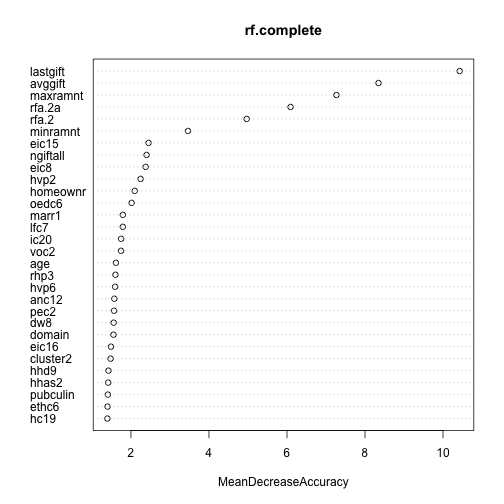
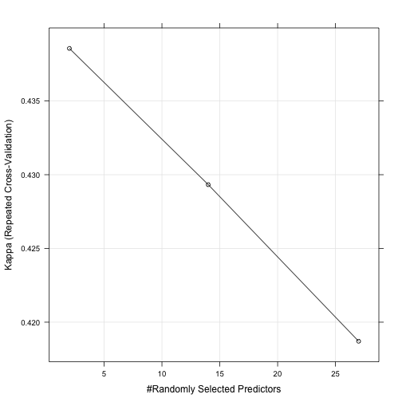

# Data set


```r
(load("clean/cup98_141211.RData"))
```

```
##  [1] "ds"                     "ds.name"               
##  [3] "ds.path"                "ds.date"               
##  [5] "target"                 "risk"                  
##  [7] "costo"                  "id"                    
##  [9] "vars.a.ignorar"         "vars"                  
## [11] "num.observaciones"      "vars.input"            
## [13] "idxs.input"             "observaciones.omitidas"
## [15] "vars.categoricas"       "idxs.categoricas"
```


```r
ds.name
```

```
## [1] "cup98"
```

```r
ds.path
```

```
## [1] "data/KDD1998/cup98lrn.txt"
```

```r
dim(ds)
```

```
## [1] 95412   482
```

```r
id
```

```
## [1] "controln"
```

```r
target
```

```
## [1] "target.b"  "target.d"  "target.d2"
```

```r
risk
```

```
## NULL
```

```r
vars.a.ignorar
```

```
##   [1] "numchld"  "solp3"    "solih"    "geocode"  "rdate.3"  "rdate.4" 
##   [7] "rdate.5"  "rdate.6"  "rdate.7"  "rdate.8"  "rdate.9"  "rdate.10"
##  [13] "rdate.11" "rdate.12" "rdate.13" "rdate.14" "rdate.15" "rdate.16"
##  [19] "rdate.17" "rdate.18" "rdate.19" "rdate.20" "rdate.21" "rdate.22"
##  [25] "rdate.23" "rdate.24" "ramnt.3"  "ramnt.4"  "ramnt.5"  "ramnt.6" 
##  [31] "ramnt.7"  "ramnt.8"  "ramnt.9"  "ramnt.10" "ramnt.11" "ramnt.12"
##  [37] "ramnt.13" "ramnt.14" "ramnt.15" "ramnt.16" "ramnt.17" "ramnt.18"
##  [43] "ramnt.19" "ramnt.20" "ramnt.21" "ramnt.22" "ramnt.23" "ramnt.24"
##  [49] "controln" "osource"  "state"    "zip"      "rfa.3"    "rfa.4"   
##  [55] "rfa.5"    "rfa.6"    "rfa.7"    "rfa.8"    "rfa.9"    "rfa.10"  
##  [61] "rfa.11"   "rfa.12"   "rfa.13"   "rfa.14"   "rfa.15"   "rfa.16"  
##  [67] "rfa.17"   "rfa.18"   "rfa.19"   "rfa.20"   "rfa.21"   "rfa.22"  
##  [73] "rfa.23"   "rfa.24"   "rfa.2r"   "lifesrc"  "dob"      "hhage1"  
##  [79] "hv1"      "eth2"     "pop901"   "mbbooks"  "hhd7"     "lfc3"    
##  [85] "afc1"     "pop902"   "odatedw"  "age905"   "ic1"      "dw4"     
##  [91] "ic2"      "dw5"      "lfc2"     "rhp1"     "ic3"      "ic14"    
##  [97] "fistdate" "age903"   "age902"   "hhp1"     "hhn3"     "hhp2"    
## [103] "eth5"     "occ9"     "ic11"     "dw6"      "age901"   "hhn4"    
## [109] "dw1"      "afc4"
```

```r
vars.input
```

```
##   [1] "tcode"    "mailcode" "pvastate" "noexch"   "recinhse" "recp3"   
##   [7] "recpgvg"  "recsweep" "mdmaud"   "domain"   "cluster"  "age"     
##  [13] "ageflag"  "homeownr" "child03"  "child07"  "child12"  "child18" 
##  [19] "income"   "gender"   "wealth1"  "hit"      "mbcraft"  "mbgarden"
##  [25] "mbcolect" "magfaml"  "magfem"   "magmale"  "pubgardn" "pubculin"
##  [31] "pubhlth"  "pubdoity" "pubnewfn" "pubphoto" "pubopp"   "datasrce"
##  [37] "malemili" "malevet"  "vietvets" "wwiivets" "localgov" "stategov"
##  [43] "fedgov"   "major"    "wealth2"  "collect1" "veterans" "bible"   
##  [49] "catlg"    "homee"    "pets"     "cdplay"   "stereo"   "pcowners"
##  [55] "photo"    "crafts"   "fisher"   "gardenin" "boats"    "walker"  
##  [61] "kidstuff" "cards"    "plates"   "pepstrfl" "pop903"   "pop90c1" 
##  [67] "pop90c2"  "pop90c3"  "pop90c4"  "pop90c5"  "eth1"     "eth3"    
##  [73] "eth4"     "eth6"     "eth7"     "eth8"     "eth9"     "eth10"   
##  [79] "eth11"    "eth12"    "eth13"    "eth14"    "eth15"    "eth16"   
##  [85] "age904"   "age906"   "age907"   "chil1"    "chil2"    "chil3"   
##  [91] "agec1"    "agec2"    "agec3"    "agec4"    "agec5"    "agec6"   
##  [97] "agec7"    "chilc1"   "chilc2"   "chilc3"   "chilc4"   "chilc5"  
## [103] "hhage2"   "hhage3"   "hhn1"     "hhn2"     "hhn5"     "hhn6"    
## [109] "marr1"    "marr2"    "marr3"    "marr4"    "dw2"      "dw3"     
## [115] "dw7"      "dw8"      "dw9"      "hv2"      "hv3"      "hv4"     
## [121] "hu1"      "hu2"      "hu3"      "hu4"      "hu5"      "hhd1"    
## [127] "hhd2"     "hhd3"     "hhd4"     "hhd5"     "hhd6"     "hhd8"    
## [133] "hhd9"     "hhd10"    "hhd11"    "hhd12"    "ethc1"    "ethc2"   
## [139] "ethc3"    "ethc4"    "ethc5"    "ethc6"    "hvp1"     "hvp2"    
## [145] "hvp3"     "hvp4"     "hvp5"     "hvp6"     "hur1"     "hur2"    
## [151] "rhp2"     "rhp3"     "rhp4"     "hupa1"    "hupa2"    "hupa3"   
## [157] "hupa4"    "hupa5"    "hupa6"    "hupa7"    "rp1"      "rp2"     
## [163] "rp3"      "rp4"      "msa"      "adi"      "dma"      "ic4"     
## [169] "ic5"      "ic6"      "ic7"      "ic8"      "ic9"      "ic10"    
## [175] "ic12"     "ic13"     "ic15"     "ic16"     "ic17"     "ic18"    
## [181] "ic19"     "ic20"     "ic21"     "ic22"     "ic23"     "hhas1"   
## [187] "hhas2"    "hhas3"    "hhas4"    "mc1"      "mc2"      "mc3"     
## [193] "tpe1"     "tpe2"     "tpe3"     "tpe4"     "tpe5"     "tpe6"    
## [199] "tpe7"     "tpe8"     "tpe9"     "pec1"     "pec2"     "tpe10"   
## [205] "tpe11"    "tpe12"    "tpe13"    "lfc1"     "lfc4"     "lfc5"    
## [211] "lfc6"     "lfc7"     "lfc8"     "lfc9"     "lfc10"    "occ1"    
## [217] "occ2"     "occ3"     "occ4"     "occ5"     "occ6"     "occ7"    
## [223] "occ8"     "occ10"    "occ11"    "occ12"    "occ13"    "eic1"    
## [229] "eic2"     "eic3"     "eic4"     "eic5"     "eic6"     "eic7"    
## [235] "eic8"     "eic9"     "eic10"    "eic11"    "eic12"    "eic13"   
## [241] "eic14"    "eic15"    "eic16"    "oedc1"    "oedc2"    "oedc3"   
## [247] "oedc4"    "oedc5"    "oedc6"    "oedc7"    "ec1"      "ec2"     
## [253] "ec3"      "ec4"      "ec5"      "ec6"      "ec7"      "ec8"     
## [259] "sec1"     "sec2"     "sec3"     "sec4"     "sec5"     "afc2"    
## [265] "afc3"     "afc5"     "afc6"     "vc1"      "vc2"      "vc3"     
## [271] "vc4"      "anc1"     "anc2"     "anc3"     "anc4"     "anc5"    
## [277] "anc6"     "anc7"     "anc8"     "anc9"     "anc10"    "anc11"   
## [283] "anc12"    "anc13"    "anc14"    "anc15"    "pobc1"    "pobc2"   
## [289] "lsc1"     "lsc2"     "lsc3"     "lsc4"     "voc1"     "voc2"    
## [295] "voc3"     "hc1"      "hc2"      "hc3"      "hc4"      "hc5"     
## [301] "hc6"      "hc7"      "hc8"      "hc9"      "hc10"     "hc11"    
## [307] "hc12"     "hc13"     "hc14"     "hc15"     "hc16"     "hc17"    
## [313] "hc18"     "hc19"     "hc20"     "hc21"     "mhuc1"    "mhuc2"   
## [319] "ac1"      "ac2"      "adate.2"  "adate.3"  "adate.4"  "adate.5" 
## [325] "adate.6"  "adate.7"  "adate.8"  "adate.9"  "adate.10" "adate.11"
## [331] "adate.12" "adate.13" "adate.14" "adate.15" "adate.16" "adate.17"
## [337] "adate.18" "adate.19" "adate.20" "adate.21" "adate.22" "adate.23"
## [343] "adate.24" "rfa.2"    "cardprom" "maxadate" "numprom"  "cardpm12"
## [349] "numprm12" "ramntall" "ngiftall" "cardgift" "minramnt" "minrdate"
## [355] "maxramnt" "maxrdate" "lastgift" "lastdate" "nextdate" "timelag" 
## [361] "avggift"  "hphone.d" "rfa.2f"   "rfa.2a"   "mdmaud.r" "mdmaud.f"
## [367] "mdmaud.a" "cluster2" "geocode2"
```

# Semilla

Generamos una secuencia aleatoria y seleccionamos una al azar como la semilla. Así podremos repetir el análisis si lo deseamos.


```r
(seed <- sample(1:1000000, 1))
```

```
## [1] 246909
```

# Variable de salida

Para este estudio, predeciremos la variable `target.d2`.


```r
ds <- as.data.frame(ds)
(outcome <- target[3])
```

```
## [1] "target.d2"
```

El costo de cada contacto es `$0.68` USD.


```r
cost <- 0.68
```

# Prueba y entrenamiento


```r
train.size <- round(num.observaciones*0.7)
test.size <- num.observaciones - train.size
```

Guardamos las columnas de salida


```r
ds.targets <- ds[, target]
dim(ds.targets)
```

```
## [1] 95412     3
```

Eliminamos las variables a ignorar


```r
ds <- ds[,c(vars.input, outcome)]
dim(ds)
```

```
## [1] 95412   370
```

```r
head(ds)
```

```
##   tcode mailcode pvastate noexch recinhse recp3 recpgvg recsweep mdmaud
## 1     0                        0                                   xxxx
## 2     1                        0                                   xxxx
## 3     1                        0                                   xxxx
## 4     0                        0                                   xxxx
## 5     0                        0        x     x                    xxxx
## 6     0                        0                                   xxxx
##   domain cluster age ageflag homeownr child03 child07 child12 child18
## 1     t2      36  60                                                 
## 2     s1      14  46       e        h                               m
## 3     r2      43  NA                u                                
## 4     r2      44  70       e        u                                
## 5     s2      16  78       e        h                                
## 6     t2      40  NA                                                 
##   income gender wealth1 hit mbcraft mbgarden mbcolect magfaml magfem
## 1     NA      f      NA   0      NA       NA       NA      NA     NA
## 2      6      m       9  16       0        0        1       1      1
## 3      3      m       1   2       0        0        0       0      0
## 4      1      f       4   2       0        0        0       0      0
## 5      3      f       2  60       1        0        0       4      1
## 6     NA             NA   0      NA       NA       NA      NA     NA
##   magmale pubgardn pubculin pubhlth pubdoity pubnewfn pubphoto pubopp
## 1      NA       NA       NA      NA       NA       NA       NA     NA
## 2       0        0        0       2        0        3        0      0
## 3       0        0        0       1        0        0        0      0
## 4       0        0        0       0        0        0        0      1
## 5       0        0        0       4        0        1        0      1
## 6      NA       NA       NA      NA       NA       NA       NA     NA
##   datasrce malemili malevet vietvets wwiivets localgov stategov fedgov
## 1       NA        0      39       34       18       10        2      1
## 2        3        0      15       55       11        6        2      1
## 3        3        0      20       29       33        6        8      1
## 4        3        0      23       14       31        3        0      3
## 5        3        1      28        9       53       26        3      2
## 6       NA        0      26       36       23        7        5      6
##   major wealth2 collect1 veterans bible catlg homee pets cdplay stereo
## 1             5                                                       
## 2             9                                                       
## 3             1                                                       
## 4             0                                                       
## 5            NA                       y     y                        y
## 6            NA                                                       
##   pcowners photo crafts fisher gardenin boats walker kidstuff cards plates
## 1                                                                         
## 2                                                                         
## 3                                                                         
## 4                                                                         
## 5                     y               y            y              y       
## 6                                                                         
##   pepstrfl pop903 pop90c1 pop90c2 pop90c3 pop90c4 pop90c5 eth1 eth3 eth4
## 1        x    332       0      35      65      47      53   92    0    0
## 2             998      99       0       0      50      50   67    0   31
## 3        x   2669       0       2      98      49      51   96    0    0
## 4        x    219       0       8      92      54      46   61    0   11
## 5             761      99       0       0      46      54    2    0    0
## 6        x   6618      81       0      19      49      51   93    1    1
##   eth6 eth7 eth8 eth9 eth10 eth11 eth12 eth13 eth14 eth15 eth16 age904
## 1    0    0    0    0     0     0     0    11     0     0     0     40
## 2    4    2    6    4    14     0     0     2     0     1     4     32
## 3    0    0    0    0     0     0     0     2     0     0     0     37
## 4    6    2    0    0     0     0     0    31     0     0     1     34
## 5    0    0    0    0     0     0     0     0     0     0     0     36
## 6    0    0    0    0     0     0     0     0     0     0     0     33
##   age906 age907 chil1 chil2 chil3 agec1 agec2 agec3 agec4 agec5 agec6
## 1     54     25    31    42    27    11    14    18    17    13    11
## 2     45     32    33    46    21    13    14    33    23    10     4
## 3     49     23    35    40    25    13    20    19    16    13    10
## 4     47     25    45    35    20    15    25    17    17    12     7
## 5     50     27    34    43    23    14    21    13    15    20    12
## 6     45     27    37    42    21    13    25    24    17    10     6
##   agec7 chilc1 chilc2 chilc3 chilc4 chilc5 hhage2 hhage3 hhn1 hhn2 hhn5
## 1    15     12     11     34     25     18     10     23   18   33   12
## 2     2     11     16     36     22     15      1      5    4   21   23
## 3     8     15     14     30     22     19     10     23   21   35    6
## 4     7     20     17     30     14     19     11     23   23   27   15
## 5     5     13     15     34     19     19      7     27   16   26   24
## 6     4     15     16     34     21     15      5     13   20   33    8
##   hhn6 marr1 marr2 marr3 marr4 dw2 dw3 dw7 dw8 dw9  hv2 hv3 hv4 hu1 hu2
## 1    4    61     7    12    19  95   2   7   7   0  635   3   2  86  14
## 2    9    69     4     3    24  99   0   0   0   0 5218  12  10  96   4
## 3    2    63     9     9    19  69   1   3   3   0  546   2   1  78  22
## 4    8    63     9     6    23  83   3   2   0   2 1263   2   1  48  52
## 5   14    42    17     9    33  98   0   0   0   0  594   4   3  90  10
## 6    2    65     9     5    21  66   0   4   4   0  899   3   3  70  30
##   hu3 hu4 hu5 hhd1 hhd2 hhd3 hhd4 hhd5 hhd6 hhd8 hhd9 hhd10 hhd11 hhd12
## 1  96   4   7   38   80   70   32   84   16    2    5     9    15     3
## 2  97   3   9   59   94   88   55   95    5    1    3     5     4     2
## 3  93   7  18   36   76   65   30   86   14    2    5    11    17     3
## 4  93   7   6   36   73   61   30   84   16    3    3    21    12     4
## 5  97   3   0   42   82   49   22   92    8    3   17     9    23     1
## 6  93   7   4   42   77   67   35   86   14    1    6    12    14     3
##   ethc1 ethc2 ethc3 ethc4 ethc5 ethc6 hvp1 hvp2 hvp3 hvp4 hvp5 hvp6 hur1
## 1    17    50    25     0     0     0    2    7   13   27   47    0    1
## 2    18    44     5     0     0     0   97   98   98   98   99   94    0
## 3    17    60    18     0     1     0    0    1    6   18   50    0    4
## 4    13    36    13     0     0     0   10   25   50   69   92   10   15
## 5     1     1     0    21    58    19    0    1    2   16   67    0    2
## 6    20    62    11     1     4     1    3    9   31   56   84    1    1
##   hur2 rhp2 rhp3 rhp4 hupa1 hupa2 hupa3 hupa4 hupa5 hupa6 hupa7 rp1 rp2
## 1   61   61   15    4     2     0     0    14     1     0     0   2   5
## 2   83   73   21    5     0     0     0     4     0     0     0  91  91
## 3   36   51   14    5     4     2    24    11     2     3     6   0   2
## 4   42   50   15    5     4     0     9    42     4     0     5   1   8
## 5   45   53   16    6     0     0     0     9     0     0     0  25  58
## 6   51   57   15    4    13    10     7     8     7    14     1   5  21
##   rp3 rp4  msa adi dma  ic4   ic5 ic6 ic7 ic8 ic9 ic10 ic12 ic13 ic15 ic16
## 1  17  73    0 177 682  378 12883  13  23  23  23   15    0    0    4   25
## 2  91  94 4480  13 803 1037 36175   2   6   2   5   15   13   10    2    5
## 3   9  44    0 281 518  340 11576  32  18  20  15   12    0    0   20   19
## 4  17  34 9340  67 862  423 15130  27  12   4  26   22    0    0   35    5
## 5  74  83 5000 127 528  321  9836  24  29  23  13    4    0    0   21   30
## 6  56  81 2030 185 691  454 15619  17  13  18  22   21    2    1   11   12
##   ic17 ic18 ic19 ic20 ic21 ic22 ic23 hhas1 hhas2 hhas3 hhas4 mc1 mc2 mc3
## 1   24   26   17    2    0    0    2    28     4    51     1  46  54   3
## 2    2    5   15   14   14   10   32     6     2    66     3  56  44   9
## 3   24   18   16    2    0    0    1    28     8    31    11  38  62   8
## 4    6   12   30    6    0    0    5    22    14    26    20  46  54   3
## 5   22   16    4    5    0    0    3    35     8    11    14  20  80   4
## 6   17   25   25    6    2    1    1    19     3    40     8  56  44  16
##   tpe1 tpe2 tpe3 tpe4 tpe5 tpe6 tpe7 tpe8 tpe9 pec1 pec2 tpe10 tpe11 tpe12
## 1   88    8    0    0    0    0    0    0    4    1   13    14    16     2
## 2   80   14    0    0    0    0    0    0    6    0    2    24    32    12
## 3   74   22    0    0    0    0    0    2    2    1   21    19    24     6
## 4   58   36    0    0    0    0    0    6    0    0   17    13    15     0
## 5   73   22    1    1    0    0    0    3    1    2    1    24    27     3
## 6   87   11    0    0    0    0    0    1    1    1   26    19    23     2
##   tpe13 lfc1 lfc4 lfc5 lfc6 lfc7 lfc8 lfc9 lfc10 occ1 occ2 occ3 occ4 occ5
## 1    45   56   64   44   62   53   99    0     0    9    3    8   13    9
## 2    71   70   81   57   64   57   99   99     0   22   24    4   21   13
## 3    61   65   70   56   78   62   82   99     4   10    5    2    6   12
## 4    43   69   68   45   33   31    0   99    23   17    3    0    6    6
## 5    76   61   65   49   80   31   81   99    10   17    8    2    6   15
## 6    66   67   77   50   58   45   79   86     3   19   13    4   12   12
##   occ6 occ7 occ8 occ10 occ11 occ12 occ13 eic1 eic2 eic3 eic4 eic5 eic6
## 1    0    3    9    15    19     5     4    3    0    3   41    1    0
## 2    2    1    6     4     1     0     3    1    0    6   13    1    2
## 3    0    1    9    18    20     5     7    6    0   11   33    4    3
## 4    0    0   13    12     0     0     0   42    0    6    3    0    0
## 5    3    7   22     9     0     7     2    2    0    6    1    5    2
## 6    0    1    7    14     9     4     3    1    0    6   32    3    4
##   eic7 eic8 eic9 eic10 eic11 eic12 eic13 eic14 eic15 eic16 oedc1 oedc2
## 1    7   13    6     5     0     4     9     4     1     3    10     2
## 2    8   18   11     4     3     4    10     7    11     1     6     2
## 3    2   12    3     3     2     0     7     8     3     3     6     7
## 4    0   23    3     3     6     0     3     3     3     3     3     0
## 5    2   12    2     7     6     4    15    29     4     3    26     3
## 6    3   15    5     3     1     1     8     7     5     6     7     5
##   oedc3 oedc4 oedc5 oedc6 oedc7 ec1 ec2 ec3 ec4 ec5 ec6 ec7 ec8 sec1 sec2
## 1     1     7    78     2     0 120  16  10  39  21   8   4   3    5   20
## 2     1    16    69     5     2 160   5   5  12  21   7  30  20   14   24
## 3     1     8    74     3     1 120  22  20  28  16   6   5   3    1   23
## 4     3     6    87     0     0 120  28  12  14  27  10   3   5    0   19
## 5     2     7    49    12     1 120  16  20  30  13   3  12   5    2   26
## 6     6     5    74     3     0 120  10  14  27  19   7  15   8    2   25
##   sec3 sec4 sec5 afc2 afc3 afc5 afc6 vc1 vc2 vc3 vc4 anc1 anc2 anc3 anc4
## 1    3   19    4    0    0   39    0  34  23  18  16    1    4    0   23
## 2    4   24   10    0    0   15    0  55  10  11   0    0    2    0    3
## 3    1   16    6    0    0   21    0  28  23  32   8    1   14    1    5
## 4    1   17    0    0    0   23    0  14  40  31  16    0    1    0   13
## 5    1   20    7    1    1   28    4   9  16  53  20    0    0    0    0
## 6    2   19    6    0    0   27    1  34  18  25  12    0   10    1    7
##   anc5 anc6 anc7 anc8 anc9 anc10 anc11 anc12 anc13 anc14 anc15 pobc1 pobc2
## 1    0    0    5    1    0     0     0     0     0     2     0     3    74
## 2    1    1    2    3    1     1     0     3     0     0     0    42    39
## 3    0    0    7    0    0     0     0     0     1     0     0     2    84
## 4    0    0    4    0    0     0     3     0     0     0     0    29    67
## 5    0    0    0    0    0     0     0     0     0     0     0     1    65
## 6    0    0   11    1    0     0     0     0     1     0     0     1    67
##   lsc1 lsc2 lsc3 lsc4 voc1 voc2 voc3 hc1 hc2 hc3 hc4 hc5 hc6 hc7 hc8 hc9
## 1   88    8    0    4   96   77   19  13  31   5  14  14  31  54  46   0
## 2   50    7   27   16   99   92   53   5  10   2  26  56  97  99   0   0
## 3   96    3    0    0   92   65   29   9  22   3  12  23  50  69  31   0
## 4   56   41    3    0   94   43   27   4  38   0  10  19  39  45  55   0
## 5   99    0    0    0   90   45   18  25  34   0   1   3   6  33  67   0
## 6   97    2    0    1   96   72   27   4  11   5  26  43  75  88  12   1
##   hc10 hc11 hc12 hc13 hc14 hc15 hc16 hc17 hc18 hc19 hc20 hc21 mhuc1 mhuc2
## 1    0   90    0   10    0    0    0   33   65   40   99   99     6     2
## 2    0   96    0    4    0    0    0   99    0   99   99   99    20     4
## 3    0    0    6   35   44    0   15   22   77   17   97   92     9     2
## 4    0   45   22   17    0    0   16   23   77   22   93   89    16     2
## 5    0    9   14   72    3    0    0   99    1   21   99   96     6     2
## 6    1    7    6   78    3    0    6   97    3   60   99   97     9     3
##   ac1 ac2 adate.2 adate.3 adate.4 adate.5 adate.6 adate.7 adate.8 adate.9
## 1  10   7    9706    9606    9604    9604    9603    9602    9601    9511
## 2   6   5    9706    9606    9604    9604    9603    9602    9601    9511
## 3   6   5    9706    9606    9604    9604    9603    9602    9601    9511
## 4   6   6    9706    9606    9604    9604    9603    9602    9601    9511
## 5   7  11    9706    9606    9604    9604    9603    9512    9601    9511
## 6   6   4    9706    9606    9604    9604    9603    9602    9601    9511
##   adate.10 adate.11 adate.12 adate.13 adate.14 adate.15 adate.16 adate.17
## 1     9510     9510     9508     9507     9506     9504     9503     9502
## 2     9510     9510     9509       NA       NA       NA     9503       NA
## 3       NA     9510     9508     9507     9506     9504     9503       NA
## 4       NA     9510     9508     9507     9506     9504     9503     9502
## 5     9510     9509     9508     9502     9506       NA     9503     9502
## 6     9510     9510     9509     9507     9506     9504     9503     9502
##   adate.18 adate.19 adate.20 adate.21 adate.22 adate.23 adate.24 rfa.2
## 1     9501     9411     9411     9410     9409     9407     9406   l4e
## 2       NA     9411     9411     9410     9409       NA     9406   l2g
## 3     9501     9411       NA       NA     9409     9407     9406   l4e
## 4     9501     9411     9411     9410     9409       NA       NA   l4e
## 5     9412     9411     9411     9410     9506     9407     9406   l2f
## 6     9501     9411     9411     9410     9409       NA     9406   l1f
##   cardprom maxadate numprom cardpm12 numprm12 ramntall ngiftall cardgift
## 1       27     9702      74        6       14      240       31       14
## 2       12     9702      32        6       13       47        3        1
## 3       26     9702      63        6       14      202       27       14
## 4       27     9702      66        6       14      109       16        7
## 5       43     9702     113       10       25      254       37        8
## 6       15     9702      35        6       12       51        4        3
##   minramnt minrdate maxramnt maxrdate lastgift lastdate nextdate timelag
## 1        5     9208       12     9402       10     9512     9003       4
## 2       10     9310       25     9512       25     9512     9504      18
## 3        2     9111       16     9207        5     9512     9101      12
## 4        2     8711       11     9411       10     9512     8711       9
## 5        3     9310       15     9601       15     9601     8005      14
## 6       10     9407       16     9412       15     9506     9407       6
##   avggift hphone.d rfa.2f rfa.2a mdmaud.r mdmaud.f mdmaud.a cluster2
## 1   7.742        0      4      e        x        x        x       39
## 2  15.667        0      2      g        x        x        x        1
## 3   7.481        1      4      e        x        x        x       60
## 4   6.812        1      4      e        x        x        x       41
## 5   6.865        1      2      f        x        x        x       26
## 6  12.750        0      1      f        x        x        x       16
##   geocode2 target.d2
## 1        c   [0,0.1)
## 2        a   [0,0.1)
## 3        c   [0,0.1)
## 4        c   [0,0.1)
## 5        a   [0,0.1)
## 6        c   [0,0.1)
```

### Tarea:  Feature Engineering

# Modelos

## Árbol de decisión

Usaremos, para fines de ilustración, la función `rpart()` del paquete `party`. Este árbol tiene los siguientes parámetros:

- `Minsplit`: Mínimo número de instancias en un nodo para considerar su división.
- `MinBucket` Mínimo número de instancias en el nodo terminal.
- `MaxSurrogate`: Número de _splits_ a evaluar.
- `MaxDepth`: Controla la máxima profundidad del árbol.

## Randomforest

#### Selección de variables por Randomforest.


```r
# Probaremos con todas las variables.

# eliminamos las donaciones 0
ds.positive.complete  <- ds[ds$target.d2 !="[0,0.1)", ]
summary(ds.positive.complete$target.d2)
```

```
##  [0,0.1) [0.1,10)  [10,15)  [15,20)  [20,25)  [25,30)  [30,50) [50,200) 
##        0     1132     1378      806      745      435      233      110 
##     NA's 
##        4
```

```r
dim(ds.positive.complete)
```

```
## [1] 4843  370
```

Eliminado el factor o clase [0,0.1)


```r
ds.positive.complete$target.d2  <- as.character(ds.positive.complete$target.d2)
ds.positive.complete$target.d2  <- as.factor(ds.positive.complete$target.d2)
```

Creando nuestros datos de entreamiento y de prueba


```r
inTrain.complete  <- createDataPartition(y=ds.positive.complete$target.d2,
                                p=0.7,list=FALSE)
training.complete  <- ds.positive.complete[inTrain.complete,]
testing.complete  <- ds.positive.complete[-inTrain.complete,]
```

Seleccionado variables importante.

```r
#creando formula para rondomForest
(form.complete  <- formula(paste(outcome,"~ ",paste(vars.input,collapse = ' + '), sep='')))
```

```
## target.d2 ~ tcode + mailcode + pvastate + noexch + recinhse + 
##     recp3 + recpgvg + recsweep + mdmaud + domain + cluster + 
##     age + ageflag + homeownr + child03 + child07 + child12 + 
##     child18 + income + gender + wealth1 + hit + mbcraft + mbgarden + 
##     mbcolect + magfaml + magfem + magmale + pubgardn + pubculin + 
##     pubhlth + pubdoity + pubnewfn + pubphoto + pubopp + datasrce + 
##     malemili + malevet + vietvets + wwiivets + localgov + stategov + 
##     fedgov + major + wealth2 + collect1 + veterans + bible + 
##     catlg + homee + pets + cdplay + stereo + pcowners + photo + 
##     crafts + fisher + gardenin + boats + walker + kidstuff + 
##     cards + plates + pepstrfl + pop903 + pop90c1 + pop90c2 + 
##     pop90c3 + pop90c4 + pop90c5 + eth1 + eth3 + eth4 + eth6 + 
##     eth7 + eth8 + eth9 + eth10 + eth11 + eth12 + eth13 + eth14 + 
##     eth15 + eth16 + age904 + age906 + age907 + chil1 + chil2 + 
##     chil3 + agec1 + agec2 + agec3 + agec4 + agec5 + agec6 + agec7 + 
##     chilc1 + chilc2 + chilc3 + chilc4 + chilc5 + hhage2 + hhage3 + 
##     hhn1 + hhn2 + hhn5 + hhn6 + marr1 + marr2 + marr3 + marr4 + 
##     dw2 + dw3 + dw7 + dw8 + dw9 + hv2 + hv3 + hv4 + hu1 + hu2 + 
##     hu3 + hu4 + hu5 + hhd1 + hhd2 + hhd3 + hhd4 + hhd5 + hhd6 + 
##     hhd8 + hhd9 + hhd10 + hhd11 + hhd12 + ethc1 + ethc2 + ethc3 + 
##     ethc4 + ethc5 + ethc6 + hvp1 + hvp2 + hvp3 + hvp4 + hvp5 + 
##     hvp6 + hur1 + hur2 + rhp2 + rhp3 + rhp4 + hupa1 + hupa2 + 
##     hupa3 + hupa4 + hupa5 + hupa6 + hupa7 + rp1 + rp2 + rp3 + 
##     rp4 + msa + adi + dma + ic4 + ic5 + ic6 + ic7 + ic8 + ic9 + 
##     ic10 + ic12 + ic13 + ic15 + ic16 + ic17 + ic18 + ic19 + ic20 + 
##     ic21 + ic22 + ic23 + hhas1 + hhas2 + hhas3 + hhas4 + mc1 + 
##     mc2 + mc3 + tpe1 + tpe2 + tpe3 + tpe4 + tpe5 + tpe6 + tpe7 + 
##     tpe8 + tpe9 + pec1 + pec2 + tpe10 + tpe11 + tpe12 + tpe13 + 
##     lfc1 + lfc4 + lfc5 + lfc6 + lfc7 + lfc8 + lfc9 + lfc10 + 
##     occ1 + occ2 + occ3 + occ4 + occ5 + occ6 + occ7 + occ8 + occ10 + 
##     occ11 + occ12 + occ13 + eic1 + eic2 + eic3 + eic4 + eic5 + 
##     eic6 + eic7 + eic8 + eic9 + eic10 + eic11 + eic12 + eic13 + 
##     eic14 + eic15 + eic16 + oedc1 + oedc2 + oedc3 + oedc4 + oedc5 + 
##     oedc6 + oedc7 + ec1 + ec2 + ec3 + ec4 + ec5 + ec6 + ec7 + 
##     ec8 + sec1 + sec2 + sec3 + sec4 + sec5 + afc2 + afc3 + afc5 + 
##     afc6 + vc1 + vc2 + vc3 + vc4 + anc1 + anc2 + anc3 + anc4 + 
##     anc5 + anc6 + anc7 + anc8 + anc9 + anc10 + anc11 + anc12 + 
##     anc13 + anc14 + anc15 + pobc1 + pobc2 + lsc1 + lsc2 + lsc3 + 
##     lsc4 + voc1 + voc2 + voc3 + hc1 + hc2 + hc3 + hc4 + hc5 + 
##     hc6 + hc7 + hc8 + hc9 + hc10 + hc11 + hc12 + hc13 + hc14 + 
##     hc15 + hc16 + hc17 + hc18 + hc19 + hc20 + hc21 + mhuc1 + 
##     mhuc2 + ac1 + ac2 + adate.2 + adate.3 + adate.4 + adate.5 + 
##     adate.6 + adate.7 + adate.8 + adate.9 + adate.10 + adate.11 + 
##     adate.12 + adate.13 + adate.14 + adate.15 + adate.16 + adate.17 + 
##     adate.18 + adate.19 + adate.20 + adate.21 + adate.22 + adate.23 + 
##     adate.24 + rfa.2 + cardprom + maxadate + numprom + cardpm12 + 
##     numprm12 + ramntall + ngiftall + cardgift + minramnt + minrdate + 
##     maxramnt + maxrdate + lastgift + lastdate + nextdate + timelag + 
##     avggift + hphone.d + rfa.2f + rfa.2a + mdmaud.r + mdmaud.f + 
##     mdmaud.a + cluster2 + geocode2
```

Feature Selection con RandomForest

```r
#Feature Selection
set.seed(123)
rf.complete  <- randomForest(form.complete,training.complete, importance=TRUE,na.action=na.omit)
imp.complete <- importance(rf.complete)
imp.complete  <- as.data.frame(imp.complete)
rf.vars.complete <- rownames(imp.complete[with(imp.complete, order(-MeanDecreaseAccuracy)), ])
#impvars  <- rf.vars.complete[1:12]
##impvar <- rownames(imp)[order(imp[, 1], decreasing=TRUE)]
varImpPlot(rf.complete, type=1)
```

 

```r
#create a partial dependence plot 
#op <- par(mfrow=c(2, 3))
#for (i in seq_along(impvars[1:6])) {
#    partialPlot(rf.complete, training.complete, impvars[i], xlab=impvars[i],
#                main=paste("Partial Dependence on",impvars[i]),
#                ylim=c(-1, 1))
#}
#par(op)
```


Seleccionamos sólo las 12 primeras variables.

Ajustamos el modelo con RandomForest con variables seleccionadas por RandomForest
 

```r
training.fs.complete  <- training.complete[,c(rf.vars.complete[1:12],outcome)]
testing.fs.complete  <- testing.complete[,c(rf.vars.complete[1:12],outcome)]

form.complete <- formula(paste(outcome, "~ ", paste(rf.vars.complete[1:12], collapse = ' + '), sep=''))

#Ajustamos Validación cruzada 10 fold.

fitControl <- trainControl(## 10-fold CV
                           method = "repeatedcv",
                           number = 10,
                           ## repeated ten times
                           repeats = 10)
                           #classProbs = TRUE)#,
                            #summaryFunction = twoClassSummary #,selectionFunction="oneSE"

#rf.grid = data.frame(.mtry=2:16)

system.time(Ajuste1 <- train(form=form.complete,data=training.fs.complete,method="rf", ntree=100,trControl = fitControl,preProcess=c("knnImpute","center","scale"),metric="Kappa")) #tuneGrid = rf.grid
```

```
##    user  system elapsed 
## 238.755   8.358  81.354
```

```r
#system.time = user(231.220), system(9.993),elapsed(82.137)

Ajuste1
```

```
## Random Forest 
## 
## 3391 samples
##   12 predictors
##    7 classes: '[0.1,10)', '[10,15)', '[15,20)', '[20,25)', '[25,30)', '[30,50)', '[50,200)' 
## 
## Pre-processing:  nearest neighbor imputation, centered, scaled 
## Resampling: Cross-Validated (10 fold, repeated 10 times) 
## 
## Summary of sample sizes: 3053, 3053, 3052, 3051, 3052, 3049, ... 
## 
## Resampling results across tuning parameters:
## 
##   mtry  Accuracy  Kappa  Accuracy SD  Kappa SD
##   2     0.6       0.4    0.02         0.03    
##   10    0.5       0.4    0.02         0.03    
##   30    0.5       0.4    0.02         0.03    
## 
## Kappa was used to select the optimal model using  the largest value.
## The final value used for the model was mtry = 2.
```

Visualizando resultados del Ajuste1

```r
#plot
trellis.par.set(caretTheme())
plot(Ajuste1, metric = "Kappa")
```

 

```r
#ggplot(Ajuste1)
#?update.train para agregar o quitar parámetros sin comenzar de nuevo todo el proceso
```

Visualizando la matriz de confusión

```r
#predict(modFit, newdata = head(testing))
confusionMatrix(Ajuste1)
```

```
## Cross-Validated (10 fold, repeated 10 times) Confusion Matrix 
## 
## (entries are percentages of table totals)
##  
##           Reference
## Prediction [0.1,10) [10,15) [15,20) [20,25) [25,30) [30,50) [50,200)
##   [0.1,10)     15.1     2.6     0.1     0.1     0.1     0.0      0.0
##   [10,15)       6.3    17.6     3.4     1.2     0.2     0.1      0.0
##   [15,20)       1.1     5.2    10.1     5.3     1.4     0.4      0.1
##   [20,25)       0.6     2.1     2.4     7.2     2.4     1.2      0.2
##   [25,30)       0.3     1.0     0.7     1.6     5.0     3.2      1.8
##   [30,50)       0.0     0.0     0.0     0.0     0.0     0.0      0.0
##   [50,200)      0.0     0.0     0.0     0.0     0.0     0.0      0.1
```


Aplicando randomforest del paquete randomforest.  EXTRA: es más rápido


```r
system.time(Ajuste2  <- randomForest(formula=form.complete,data=
                                                  training.fs.complete,na.action=na.omit))
```

```
##    user  system elapsed 
##   23.42    0.07   23.49
```

```r
#system.time = user(24.329), system(0.079),elapsed(24.406)
Ajuste2
```

```
## 
## Call:
##  randomForest(formula = form.complete, data = training.fs.complete,      na.action = na.omit) 
##                Type of random forest: classification
##                      Number of trees: 500
## No. of variables tried at each split: 3
## 
##         OOB estimate of  error rate: 43.62%
## Confusion matrix:
##          [0.1,10) [10,15) [15,20) [20,25) [25,30) [30,50) [50,200)
## [0.1,10)      590     151      26      18       3       3        2
## [10,15)       152     590     116      75      22       8        2
## [15,20)        15     151     277     102      17       2        1
## [20,25)         4      60     144     254      49       6        5
## [25,30)         5      17      41      87     124      25        6
## [30,50)         0       8       9      45      58      36        8
## [50,200)        2       2       3       5      11      13       41
##          class.error
## [0.1,10)      0.2560
## [10,15)       0.3886
## [15,20)       0.5097
## [20,25)       0.5134
## [25,30)       0.5934
## [30,50)       0.7805
## [50,200)      0.4675
```

Visualizando el error, comparando en el modelo de 1 a 14 interacciones.

```r
#Test error, aplica cuando es regresión.
oob.err <- double(26)
test.err <- double(26)
for(mtry in 1:14){
    fit  <-  randomForest(formula=form.complete,data=training.fs.complete,na.action=na.omit,mtry=mtry,ntree=400)
    oob.err[mtry] <- fit$err.rate[400]
    pred <-  predict(fit,testing.fs.complete)
    #test.err[mtry] <- with(testing.fs,mean((target.d2-pred)^2)) #regresión
    cat(mtry," ")
}

matplot(1:mtry,oob.err,pch=19,col=c("blue"),type="b",ylab="Mean Squared Error")
legend("topright",legend=c("008","Test"),pch=19,col=c("red","blue"))
```


#### FEATURE SELECCION tomando encuenta la correlación.

En selección de variables con randomforest, castiga mucho la correlación, por lo que si dos variables, aunque sean muy importantes al modelo, si hay correlación las elemina.

Es una desventaja, por lo que se debe de analizar ambas posturas e investigar por criterio y con expertos.


```r
### correlación caret packages

var.num  <- training.fs.complete[sapply(training.fs.complete,is.numeric)]

descrCor <- cor(var.num,use="complete")
summary(descrCor[upper.tri(descrCor)])
```

```
##    Min. 1st Qu.  Median    Mean 3rd Qu.    Max. 
## -0.4390 -0.0672  0.0314  0.1120  0.1530  0.8300
```

Quedandonos con variables correlacionadas en menos de 0.75

```r
highlyCorDescr <- findCorrelation(descrCor, cutoff = 0.75)
filteredDescr <- var.num[, -highlyCorDescr]
descrCor2 <- cor(filteredDescr)
vars  <- c(names(filteredDescr))

summary(descrCor2[upper.tri(descrCor2)])
```

```
##    Min. 1st Qu.  Median    Mean 3rd Qu.    Max. 
## -0.4390 -0.0834 -0.0081  0.0199  0.0863  0.3750
```

Prueba. Resultado: el error subió ligeramente a 43.08%. Las variables son muy similares que las seleccionadas por RandomForest, sin incluir a las variables "rfa.2a", "rfa.2" que son categóricas.


```r
(form.cor <- formula(paste(outcome, "~ ", paste(vars, collapse = ' + '), sep='')))
```

```
## target.d2 ~ maxramnt + minramnt + eic15 + ngiftall + eic8 + hvp2 + 
##     oedc6
```

Prueba.

```r
training.fs.cor  <- training.complete[,c(vars,outcome)]
testing.fs.cor  <- testing.complete[,c(vars,outcome)]

system.time(Ajuste3  <- randomForest(formula=form.cor,data=training.fs.cor,na.action=na.omit))
```

```
##    user  system elapsed 
##   2.235   0.038   2.272
```

```r
#system.time = user(24.329), system(0.079),elapsed(24.406)
Ajuste3
```

```
## 
## Call:
##  randomForest(formula = form.cor, data = training.fs.cor, na.action = na.omit) 
##                Type of random forest: classification
##                      Number of trees: 500
## No. of variables tried at each split: 2
## 
##         OOB estimate of  error rate: 54.79%
## Confusion matrix:
##          [0.1,10) [10,15) [15,20) [20,25) [25,30) [30,50) [50,200)
## [0.1,10)      491     233      37      20       8       3        1
## [10,15)       200     492     133      91      35      10        4
## [15,20)        21     181     209     122      29       3        0
## [20,25)         4      92     137     208      64      15        2
## [25,30)         5      38      35     101      88      27       11
## [30,50)         2      15      11      44      59      26        7
## [50,200)        2       5       3       8      26      14       19
##          class.error
## [0.1,10)      0.3808
## [10,15)       0.4902
## [15,20)       0.6301
## [20,25)       0.6015
## [25,30)       0.7115
## [30,50)       0.8415
## [50,200)      0.7532
```


### Aplicando la misma selección de variables con RamdonForest y con Correlación al algoritmo de Árbol de Decisión.

selección RandomForest.

```r
(form.complete <- formula(paste(outcome, "~ ", paste(rf.vars.complete[1:12], collapse = ' + '), sep='')))
```

```
## target.d2 ~ lastgift + avggift + maxramnt + rfa.2a + rfa.2 + 
##     minramnt + eic15 + ngiftall + eic8 + hvp2 + homeownr + oedc6
```


selección Correlación.

```r
(form.cor <- formula(paste(outcome, "~ ", paste(vars, collapse = ' + '), sep='')))
```

```
## target.d2 ~ maxramnt + minramnt + eic15 + ngiftall + eic8 + hvp2 + 
##     oedc6
```


CART-Arbol de decisión. variables RondomForest


```r
system.time(Ajuste4 <- train(form=form.complete,data=training.fs.complete,method="rpart2",trControl = fitControl,preProcess=c("knnImpute","center","scale"),metric="Kappa",maxdepth=10)) #tuneGrid = rf.grid
```

```
##    user  system elapsed 
## 100.787   4.185   9.576
```

```r
#system.time = user(231.220), system(9.993),elapsed(82.137)

Ajuste4
```

```
## CART 
## 
## 3391 samples
##   12 predictors
##    7 classes: '[0.1,10)', '[10,15)', '[15,20)', '[20,25)', '[25,30)', '[30,50)', '[50,200)' 
## 
## Pre-processing:  nearest neighbor imputation, centered, scaled 
## Resampling: Cross-Validated (10 fold, repeated 10 times) 
## 
## Summary of sample sizes: 3051, 3054, 3051, 3050, 3052, 3052, ... 
## 
## Resampling results across tuning parameters:
## 
##   maxdepth  Accuracy  Kappa  Accuracy SD  Kappa SD
##   1         0.4       0.2    0.02         0.02    
##   2         0.5       0.3    0.02         0.03    
##   3         0.5       0.4    0.03         0.04    
## 
## Kappa was used to select the optimal model using  the largest value.
## The final value used for the model was maxdepth = 3.
```

CART - Arbol de decisión. variables Correlación.


```r
system.time(Ajuste5 <- train(form=form.cor,data=training.fs.complete,method="rpart2",trControl = fitControl,preProcess=c("knnImpute","center","scale"),metric="Kappa",maxdepth=10)) #tuneGrid = rf.grid
```

```
##    user  system elapsed 
##  14.449   1.067   4.285
```

```r
#system.time = user(231.220), system(9.993),elapsed(82.137)

Ajuste5
```

```
## CART 
## 
## 3391 samples
##   12 predictors
##    7 classes: '[0.1,10)', '[10,15)', '[15,20)', '[20,25)', '[25,30)', '[30,50)', '[50,200)' 
## 
## Pre-processing:  nearest neighbor imputation, centered, scaled 
## Resampling: Cross-Validated (10 fold, repeated 10 times) 
## 
## Summary of sample sizes: 3050, 3052, 3053, 3053, 3053, 3051, ... 
## 
## Resampling results across tuning parameters:
## 
##   maxdepth  Accuracy  Kappa  Accuracy SD  Kappa SD
##   1         0.3       0.2    0.01         0.02    
##   2         0.4       0.3    0.02         0.02    
##   3         0.5       0.4    0.03         0.03    
## 
## Kappa was used to select the optimal model using  the largest value.
## The final value used for the model was maxdepth = 3.
```

Pruebas con rpart


```r
system.time(Ajuste6 <-rpart(form=form.complete,data=training.fs.complete,
control=rpart.control(maxdepth=10)))
```

```
##    user  system elapsed 
##   0.118   0.001   0.119
```

```r
Ajuste6
```

```
## n= 3391 
## 
## node), split, n, loss, yval, (yprob)
##       * denotes terminal node
## 
##   1) root 3391 2426 [10,15) (0.23 0.28 0.17 0.15 0.09 0.048 0.023)  
##     2) lastgift< 9.5 767  184 [0.1,10) (0.76 0.2 0.018 0.013 0.0052 0 0.0013) *
##     3) lastgift>=9.5 2624 1814 [10,15) (0.08 0.31 0.21 0.2 0.11 0.062 0.029)  
##       6) lastgift< 14.5 933  352 [10,15) (0.17 0.62 0.14 0.055 0.014 0.0054 0.0011) *
##       7) lastgift>=14.5 1691 1230 [20,25) (0.033 0.14 0.25 0.27 0.17 0.094 0.044)  
##        14) lastgift< 19.5 776  418 [15,20) (0.04 0.18 0.46 0.23 0.064 0.021 0.0052) *
##        15) lastgift>=19.5 915  634 [20,25) (0.027 0.1 0.071 0.31 0.26 0.16 0.078)  
##          30) rfa.2=l1e,l1f,l2f,l3f,l4e,l4f 486  250 [20,25) (0.037 0.13 0.095 0.49 0.16 0.08 0.012) *
##          31) rfa.2=l1g,l2g,l3g,l4g 429  268 [25,30) (0.016 0.065 0.044 0.1 0.38 0.24 0.15)  
##            62) lastgift< 44 373  218 [25,30) (0.016 0.07 0.048 0.11 0.42 0.27 0.072)  
##             124) lastgift< 28.5 277  142 [25,30) (0.014 0.083 0.058 0.12 0.49 0.2 0.032) *
##             125) lastgift>=28.5 96   51 [30,50) (0.021 0.031 0.021 0.062 0.21 0.47 0.19) *
##            63) lastgift>=44 56   18 [50,200) (0.018 0.036 0.018 0.089 0.11 0.054 0.68) *
```


```r
rpart1a<-as.party(Ajuste6)
```

```
## Error: could not find function "as.party"
```

```r
plot(rpart1a)
```

```
## Error: error in evaluating the argument 'x' in selecting a method for function 'plot': Error: object 'rpart1a' not found
```

testing


```r
rpartPred<-predict(Ajuste6,testing.fs.complete,type="class")
confusionMatrix(rpartPred,testing.fs.complete$target.d2)
```

```
## Confusion Matrix and Statistics
## 
##           Reference
## Prediction [0.1,10) [10,15) [15,20) [20,25) [25,30) [30,50) [50,200)
##   [0.1,10)      245      56      10       7       1       1        0
##   [10,15)        63     239      54      15       7       2        3
##   [15,20)        17      73     145      75      13       1        3
##   [20,25)         7      32      22     104      31      14        2
##   [25,30)         4      12       7      19      60      20        4
##   [30,50)         2       0       3       0      11      29        2
##   [50,200)        1       1       0       3       7       2       19
## 
## Overall Statistics
##                                         
##                Accuracy : 0.581         
##                  95% CI : (0.555, 0.606)
##     No Information Rate : 0.285         
##     P-Value [Acc > NIR] : < 2e-16       
##                                         
##                   Kappa : 0.478         
##  Mcnemar's Test P-Value : 8.11e-08      
## 
## Statistics by Class:
## 
##                      Class: [0.1,10) Class: [10,15) Class: [15,20)
## Sensitivity                    0.723          0.579          0.602
## Specificity                    0.932          0.861          0.849
## Pos Pred Value                 0.766          0.624          0.443
## Neg Pred Value                 0.917          0.837          0.914
## Prevalence                     0.234          0.285          0.166
## Detection Rate                 0.169          0.165          0.100
## Detection Prevalence           0.221          0.265          0.226
## Balanced Accuracy              0.828          0.720          0.725
##                      Class: [20,25) Class: [25,30) Class: [30,50)
## Sensitivity                  0.4664         0.4615         0.4203
## Specificity                  0.9118         0.9499         0.9869
## Pos Pred Value               0.4906         0.4762         0.6170
## Neg Pred Value               0.9037         0.9470         0.9714
## Prevalence                   0.1540         0.0898         0.0477
## Detection Rate               0.0718         0.0414         0.0200
## Detection Prevalence         0.1464         0.0870         0.0325
## Balanced Accuracy            0.6891         0.7057         0.7036
##                      Class: [50,200)
## Sensitivity                   0.5758
## Specificity                   0.9901
## Pos Pred Value                0.5758
## Neg Pred Value                0.9901
## Prevalence                    0.0228
## Detection Rate                0.0131
## Detection Prevalence          0.0228
## Balanced Accuracy             0.7829
```

