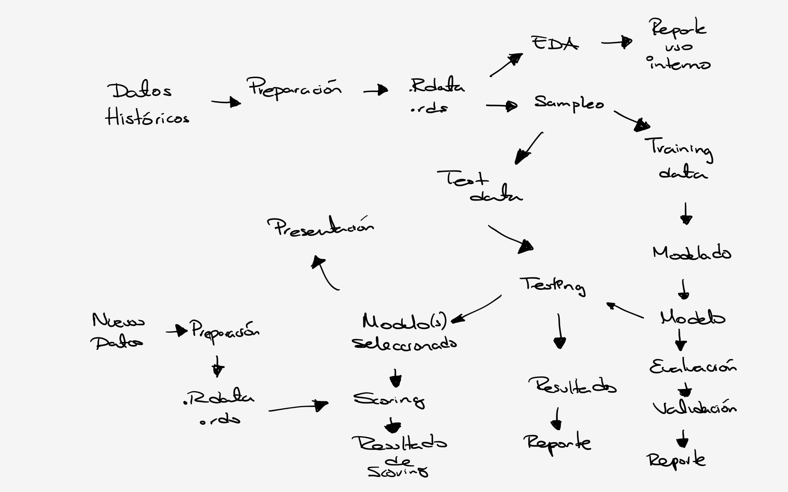
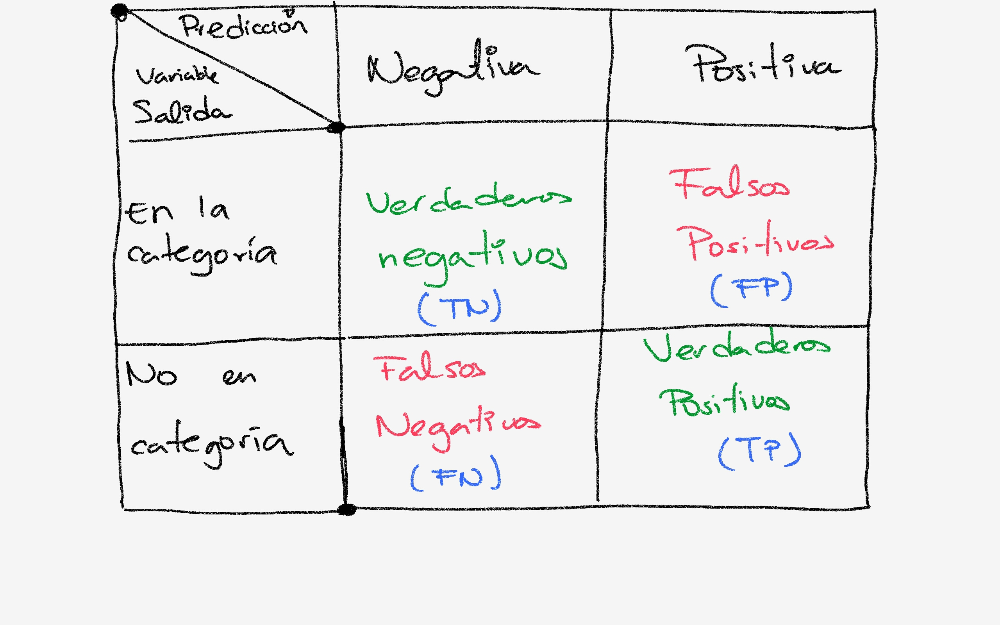
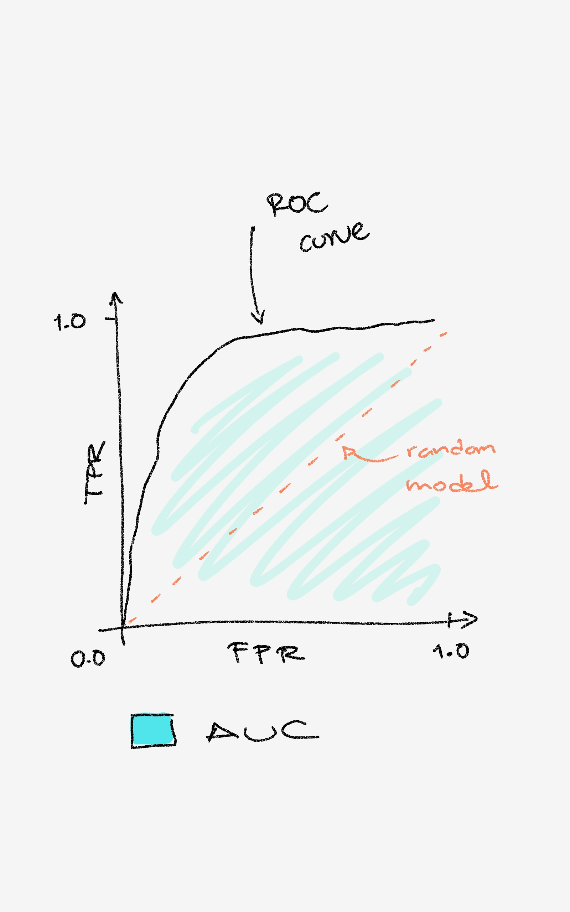
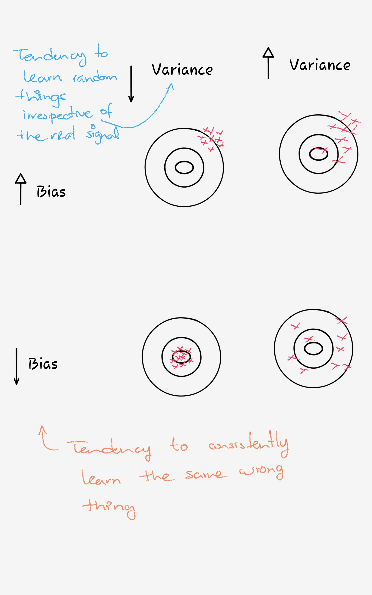

## Recuerda... {.flexbox .vcenter}

- Tu objetivo final es resolver un problema de negocio concreto.

- Tu tarea es mapear un problema de negocio a una técnica de modelado.

- Cada método estadístico tendrá sus ventajas y desventajas respecto a un conjunto dado de metas de negocio y restricciones de negocio. 

- Debes de ser capaz de medir la calidad de tu modelo durante el entrenamiento y también asegurar que tu modelo funcionará bien en un ambiente productivo.

# Modelando
 
## Procedimiento {.flexbox .vcenter}


## Procedimiento {.flexbox .vcenter}




## Procedimiento
- Mapeamos el problema de negocio a una técnica de modelado.

- Dividimos (por lo menos) a los datos en dos: <span class="blue">training</span> y <span class="green">testing</span>

- Esto lo hacemos para hacer pruebas en el modelo + datos:
    - Evaluación del modelo
    - Valudación del modelo

## Evaluación del modelo {.flexbox .vcenter}
- <span class="blue">Evaluación</span> del modelo
    - Cuantificación del desempeño del modelo.
    - Encontrar medidas que sean apropiadas para la meta de negocio y para la técnica que estamos usando.
    
## Validación del modelo {.flexbox .vcenter}
- <span class="green">Validación</span> del modelo
    - Procedimiento para verificar (con una medida de certidumbre) de que el modelo se comportará en producción tan bien como lo hizo en entrenamiento.
    - Un problema muy grande para este procedimiento pueden ser:
        - No hay suficientes datos para tener un conjunto de <span class="yellow"> training </span> data.
        - Los datos de entrenamiento no tienen la suficiente variedad comparada con producción.
        

# Métodos

## Clasificación {.flexbox .vcenter}

- ¿Qué tipo es?

- Pertenece a las técnicas de <span class="yellow">supervised learning</span>.

- Crear un conjunto de datos para entrenamiento es muy caro (en `$`), a este proceso se le conoce como <span class="red"> etiquetado </span>.


## Clasificación {.flexbox .vcenter .tiny}

Algunos ejemplos

| Técnica | Notas|
|-----|-----|
| Naïve Bayes | Muchas variables de entrada, categóricas con muchos niveles, clasificación de texto |
| Árboles de decisión | Variables de entrada interactúan con la salida de manera `if-then`. Las variables de entrada son redundantes o están correlacionadas. |
| Regresión Logística | Estimar las probabilidades de pertenencia a la clase de salida. Quieres conocer el impacto relativo de las variables de entrada a las de salida.|
| SVM | Muchas variables de entrada que interactuan de maneras complicadas o no-lineales. Hace pocas suposiciones sobre la distribución de las variables, lo cual lo hace bueno cuando no los datos de entrenamiento no sean tan representativos de lo que pasa en producción.|

## Regresión/Scoring {.flexbox .vcenter}

- ¿Cuánto?
    - Ejemplo: ¿Cuánto van a aumentar las ventas por esta campaña?
    - Aunque Detección de fraude, puede ser considerado scoring: Tratas de estimar la probabilidad de que una transacción en particular sea fraudulenta.

- Ejemplos son la regresión logística y la regresión lineal.

## Cuando no hay variable de salida (*target*) {.smaller}

- Pertenece a las técnicas de <span class="yellow">unsupervised learning</span>.

- En lugar de predecir las variables de salida usando las variables de entrada, el objetivo es descubir similitudes y relaciones en los datos.

- Ejemplos:
    - Agrupamiento por `k-means`
        - Segmentar `clientes` por patrones similares de compra. 
    - Algoritmo `apriori`.
        - Segmentar `productos` que se compran juntos.
    - Vecinos cercanos.
        - Decir algo sobre el punto `p` respecto a puntos que más se parecen a `p`.


## Ejercicio {.flexbox .vcenter .tiny}

| Tarea a realizar | ¿Descripción? | ¿Tipo de método?|
|---------|-----------|-------------|
| Identificar `spam`. Asignar productos a un catálogo existente. Identificar préstamos que pueden fallar. Asignar clientes a `clusters` de clientes. | Asignar etiquetas a objetos | Clasificación |
| Predecir el valor de `AdWords`. Estimar la probabilidad de que un préstamo haga `default`. Predecir cuánto una campaña va a aumentar el tráfico de un portal. | | |
| Encontrar que productos son comprados juntos. Identificar que páginas son visitadas en la misma sesión. Identificar que combinaciones de páginas y AdWords son exitosas| | |
| Identificar grupos de clientes con los mismos patrones de compra. Identificar grupos de productos que son populares en las mismas regiones o en los mismos clusters de clientes. | | |

## Ejercicio (continuación) {.flexbox .vcenter .tiny}

| Tarea a realizar | ¿Descripción? | ¿Tipo de método?|
|---------|-----------|-------------|
| Hacer recomendaciones de productos para un cliente, basado en lo que otro cliente a comprado. Predecir el precio final de un producto en una subasta, basado en productos similares que se han subastado en el pasado | | |
| Predecir que van a comprar un cliente basado en sus compras pasadas| | |
| Determinar la elasticidad del precio | | |
| ¿Cuánto debemos de gastar en una campaña de `AdWords`? | | |
| Organizar productos en un catálogo no existente | | |


# Evaluación

## Generalidades  {.flexbox .vcenter }

- Después de construir un modelo, hay que verificar que por lo menos funcione con los datos con los que fué creado (entrenado).

- Para cuantificar el "que funcione" debemos de escoger algunas metricas.

- La métrica a elegir dependerá de que método (y dataset) y meta de negocio.

## ¿Cómo saber si es bueno?

- Utilizaremos algunos modelos idealizados:
    - Modelo nulo 
        - Nos enseña cuál es el mínimo.
    - Modelo `Bayes rate`
        - Indica cuál puede ser el máximo posible.
    - El mejor modelo de una sóla variable.
        - Indica que es lo mejor que puede hacer un modelo simple.
        
## Modelo nulo 

- Es aquel modelo que quieres vencer (es el mínimo, `lower bound`).

- Dos modelos típicos: <span class="red">constante</span> e <span class="blue">independiente</span>.

- El modelo constante, siempre devuelve la misma respuesta para todas las ocasiones.
    - e.g. Si es categórica la salida, el modelo siempre devuelve el valor más popular (se equivoca menos). Si es numérica regresará la media (su desviación cuadrática es menor).
    
- El modelo independiente, no guarda ninguna relación o interacción entre las variables de entrada y salida, puede ser un modelo al azar (e.g. tirando una moneda para decidir en una clasificación binaria).

## Modelo Bayes rate 

- También se conoce como <span class="green2">Modelo Saturado</span>.

- El mejor modelo posible con los datos disponibles, de hecho, es el modelo perfecto: sólo se equivoca cuando no hay unicidad en $x \to y$ (el mismo conjunto de $x$ da diferentes $y$ ).

- Nos da el `upper bound`.

## Mejor modelo de una variable

- Un modelo complicado no puede justificarse si no puede mejorar un modelo simple de una sola variable.

- Muchos clientes o usuarios que pueden manejar MS Excel y sus `pivot tables` pueden generar modelos de una sola variable, ellos querrán comparar a este nivel, por lo que siempre es bueno tenerlos en mente.


## Evaluación de modelos de clasificación {.flexbox .vcenter .smaller}

- La herramienta más usada para evaluar modelos de clasificación es la <span class="blue3"> matriz de confusión</span>.

- Resume todas las predicciones del modelo, contra las categorías conocidas.




## Evaluación de modelos de clasificación {.flexbox .vcenter }

- `Accuracy`: 

- **Pregunta de negocio**: *Necesitamos que la mayoría de las decisiones sean las correctas*.

$$
acc = \frac{TP  + TN}{TP+FP+TN+FN}
$$

- No sirve para dataset no balanceados (por ejemplo en detección de fraude). 
    - En este caso el modelo nulo es muy preciso (very accurate). Esto no lo hace el mejor modelo.
    - Hay que considerar una función de costo.
    
## Evaluación de modelos de clasificación {.flexbox .vcenter .smaller}

- `Precision`
    - **Pregunta de negocio**: *Lo que marquemos como $x$, más vale que sea $x$*.
    - ¿Qué fracción clasificada por el modelo están en la clase?
    - Cuando el modelo dice `está en la clase`, que tan frecuentemente le atina.  
    
$$
prec = \frac{TP}{TP+FP}
$$

- `Recall`
    - **Pregunta de negocio**: *Queremos reducir $x$ por en un tanto por ciento*.
    - ¿Qué fracción que están en la clase fueron detectadas por el modelo?
    - que tan frecuentemente el clasificador encuentra lo que debe de encontrar.
    
$$
rec = \frac{TP}{TP+FN}
$$

## Evaluación de modelos de clasificación {.flexbox .vcenter}

- `F1 score`
    - Se usa en conjunto con `precision` y `recall`.
    - Mide el sacrificio de `recall` y/o `precision` uno respecto al otro.
    
$$
F1 = \frac{2*prec*rec}{prec + rec}
$$

## Evaluación de modelos de clasificación {.flexbox .vcenter .smaller}

- `Sensitivity`
    - **Pregunta de negocio**: *Necesitamos reducir la clase $x$ o no hay negocio*.
    - Conocida como `true positive rate` (TPR) es igual al `recall`.
    
- `Specificity`
    - **Pregunta de negocio**: *No podemos equivocarnos en $\sim x$, el sistema (o el usuario) deben de tener este servicio altísimo*.
    - Conocida también como `true negative rate`
    
$$
spec = \frac{TN}{TN+FP}
$$

- El modelo nulo regularmente clasifica con $0$ en una de los dos, por lo que los modelos que no sirven, tienen muy bajo uno de estas métricas.

## Ejercicio {.flexbox .vcenter }

- Para una aplicación muy desbalanceada (digamos `1%` de la clase $x$ y `99%` de la clase $\sim x$)

    - e.g.  detección de spam, fraude, etc.
    
- ¿Cuáles serían las mejores métricas a discutir con el cliente? 

- ¿Cuáles serían los valores de las metricas para el modelo nulo?

## Evaluación de modelos de regresión {.flexbox .vcenter .smaller}

- `residuos` es la palabra clave.
    - Diferencia entre nuestras predicciones $\hat{y}$ y los valores reales de salida $y$.
    
- `RMSE`: Root mean square error
    - **Pregunta de negocio**: *Queremos un error (en promedio) menor de tantos miles por unidad estudiada*.
    -  Se puede pensar como una desviación estándar.
    -  Está en las mismas unidades que $y$.
    - Hay que corregir por `bias` o complejidad, o tamaño de la muestra.
    
## Evaluación de modelos de regresión {.flexbox .vcenter .smaller}

- $R^2$
    - **Pregunta de negocio**: *Queremos un modelo que explique tanto porcentaje del valor de tal*.
    - 1.0 menos cuanta varianza no estamos explicando por el modelo. 
        $$ 1 - \frac{\sum(\hat{y} - y)}{[\sum(\bar{y} - y)]^2} $$
    - No tiene unidades.
    - Cerca de cero o negativa significa que el modelo es lo peor que nos pudo pasar.
   
## Evaluación de modelos de probabilidad {.flexbox .vcenter }

- Sirven para clasificación o para regresión.
- Indican la probabilidad estimada (confianza, vamos) de que la observación pertenezca a una clase.
- Hay que elegir un `cut-off`.


## Evaluación de modelos de probabilidad {.vcenter .tiny}

- Gráfica de doble densidad

```{r eval=FALSE}
# Ejemplo para generar una gráfica de doble densidad
ggplot(data=ds) + geom_density(aes(x=pred, color=clase, linetype=clase))
```


## Evaluación de modelos de probabilidad {.flexbox .vcenter .smaller}
- `ROC curve`: *Receiver operating characteristic curve* 
    - Una buena explicación está [aquí](http://www.anaesthetist.com/mnm/stats/roc/Findex.htm)

- `AUC`: *area under the curve*
    - No recomendable ver críticas [aquí](http://www2.unil.ch/biomapper/Download/Lobo-GloEcoBioGeo-2007.pdf)




## Evaluación de modelos de probabilidad {.flexbox .vcenter }

```{r eval=FALSE}
# código para dibujar el ROC con ggplot
```


## Evaluación de modelos de probabilidad {.flexbox .vcenter .tiny}

```{r rocr, eval=TRUE, message=FALSE}
library(ROCR,quietly = TRUE)
data(ROCR.simple)  # Datos de prueba

pred <- prediction(ROCR.simple$predictions, ROCR.simple$labels)
perf <- performance(pred, "tpr", "fpr")  # Graficamos ROC, este paquete permite muchas gráficas
plot(perf, colorize=TRUE)
```


## Evaluación de modelos de probabilidad {.flexbox .vcenter .smaller}

- `log likelihood`
    - El logaritmo del producto de la probabilidad que asigna el modelo a cada ejemplo. (Regularmente se rescala por el número de puntos)
    - Siempre es negativo, y el modelo es mejor si se acerca a $0$.

- `entropía condicional`
    - Se mide en `bits`.
    - Es una medidad de **sorpresa** en los datos...
    - Si `p` es un vector conteniendo la probabilidad de cada posible evento, la entropía es
    
      $$
        entropia(p) = \sum_i (p_i*log_2(p_i))
      $$
    - Indica que tan buena es la predicción de cada categoría, pesada por que tan frecuente predice la categoría.
    
      $$ 
      \frac{pos * entropia(pos) + neg * entropia(neg) }{observaciones}
      $$
      
    
## Evaluación de modelos de clustering {.flexbox .vcenter }

- Son difíciles de evaluar $\to$ verificar resumenes de la clusterización.

- Número de clusters

- Número de observaciones por cluster.
    - `hair clusters` : Muy pocas observaciones
    - `waste clusters`: Muchos puntos 
    
- Compactos
    - Comparar la distancia entre dos puntos en el cluster con la distancia típica entre dos clusters.
    

# Validación

## Validación {.vcenter .flexbox} 

¿Mostrará el mismo desempeño el modelo en producción que con los datos de entrenamiento?

## Problemas con el modelo

- `Bias`

- `Variance`

- `Overfit`

- `Nonsignificance`

## Problemas con el modelo {.flexbox .vcenter .tiny}



<span class="blue3">Basado en la imagen de "A few useful things to know about machine learning" de Pedro Domingos</span>

## Validación: Hold-out data

- Los datos de entrenamiento no son la mejor manera de probar el desempeño del modelo.
- Si lo haces obtendrás mediciones exageradas. (Tienen un <span class="red">bias</span>)
- Por eso dividimos en entrenamiento y prueba los datos. 
    - Inclusive se puede dividir en entrenamiento, calibración y prueba.


## Validación: K-fold cross-validation {.smaller}

- El problema con el método anterior es que sólo te da un punto para estimar el desempeño
    - e.g "El modelo tuvo un desempeño en accuracy del 83% en los datos de prueba"

- Además de querer un estimado sin <span class="red">bias</span> queremos un estimado de la distribución de este estimado.

- La idea del <span class="blue">k-fold cross-validation</span> es repetir la construcción del modelo en diferentes subconjuntos de los datos de entrenamiento y evaluarlo en datos que no se usaron para entrenar.

- Dividimos los datos en $k$ subconjuntos del mismo tamaño, construimos el modelo $k$ veces y en cada iteración dejamos un subconjunto como <span class="green">prueba</span>

- Debido a que esto es repetitivo es necesario automatizar la construcción del modelo.

- `Leave one out`, ocurre cuando $k$ es igual al tamaño de los datos 
    - e.g. entrenamos con todos salvo uno y probamos con ese uno.

## Validación: Test de significacia

- Probar estadísticamente que el desempeño de nuestro modelo es bueno $\to$  es muy poco probable que el modelo nulo tuviera el mismo desempeño.

- Queremos probar que si nuestro modelo fué mejor que el modelo nulo, no haya sido casualidad.

- La <span class="green3">hipótesis nula</span> sería, por ejemplo, 
$$\mathcal{H}_o = (error.modelo - error.nulo) == 0$$
en promedio.


## Tarea

- Formen cuatro equipos, escojan bien, serán sus compañeros el resto del curso.

- Cada equipo escogerá (no se puede repetir) una lectura de la carpeta `readings`. 

- Expondrán el contenido la siguiente clase. 45 minutos de exposición.

